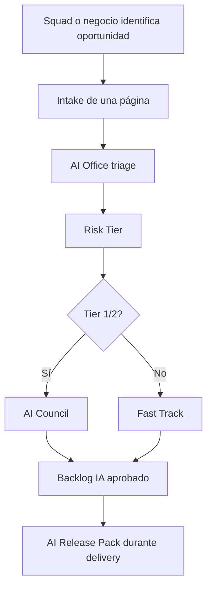

# Intake y portfolio de casos IA

# Objetivo

Registrar, clasificar, priorizar y dar seguimiento a los casos de uso de IA 
con los documentos necesarios.

# Flujo de intake



# Campos mínimos de intake

| Campo | Descripción | Ejemplo |
|---|---|---|
| Use Case ID | Código único | AI-UC-2026-001 |
| Nombre | Nombre entendible | Motor de fraude CNP |
| Dominio | Negocio responsable | Riesgo Transaccional |
| Tipo IA | ML, GenAI, RAG, agente, OCR | ML supervisado |
| Decisión que apoya | Qué decisión/recomendación produce | Aprobar, desafiar o revisar transacción |
| Impacto cliente | Sí/no y cómo | Puede retener transacciones |
| Datos | Fuentes principales | transacciones, device, merchant risk |
| Owner negocio | Responsable de valor y riesgo | Gerencia Riesgo Transaccional |
| Owner técnico | Responsable de delivery y operación | Data Science Fraude |
| Beneficio esperado | Valor económico u operativo | PEN 7.8MM fraude evitado/año |
| Tier inicial | Clasificación preliminar | Tier 1 |
| Estado | Idea, Discovery, Build, Pilot, Prod, Retired | Pilot |

# Priorización simple

Score recomendado:

```text
priority_score = valor_negocio * 0.35 + urgencia_regulatoria * 0.20 + factibilidad * 0.20 + reduccion_riesgo * 0.15 + reutilizacion * 0.10
```

Escala 1 a 5. No usar más variables para evitar sobreingeniería.

# Portfolio simulado

| ID | Caso | Tipo | Tier | Estado | Valor anual estimado | Decisión |
|---|---|---|---|---|---:|---|
| AI-UC-2026-001 | Motor de fraude CNP tarjetas | ML | Tier 1 | Piloto | PEN 7.8MM | desafiar/revisar transacción |
| AI-UC-2026-002 | Scoring alternativo microcrédito wallet | ML | Tier 1 | Discovery | PEN 5.4MM | recomendar límite |
| AI-UC-2026-003 | Copiloto reclamos de tarjeta | RAG/GenAI | Tier 2 | Build | PEN 1.6MM | sugerir respuesta |
| AI-UC-2026-004 | RAG normativo compliance | RAG | Tier 3 | Prod | PEN 0.8MM | responder consultas internas |
| AI-UC-2026-005 | Agente conciliaciones backoffice | Agente | Tier 2 | Pilot | PEN 2.1MM | crear tareas y proponer ajustes |
| AI-UC-2026-006 | Propensión cross-sell préstamos | ML | Tier 3 | Prod | PEN 3.2MM | recomendar oferta |
| AI-UC-2026-007 | OCR KYC documento de identidad | CV/OCR | Tier 2 | Build | PEN 1.9MM | validar datos extraídos |
| AI-UC-2026-008 | Predicción mora temprana | ML | Tier 2 | Discovery | PEN 4.3MM | priorizar gestión preventiva |

# Criterios de rechazo temprano

Un caso no avanza si:

- no tiene owner de negocio;
- no tiene propósito legítimo;
- depende de datos no autorizados;
- requiere un uso prohibido por política;
- no tiene beneficio medible;
- no puede ser monitoreado;
- no tiene forma razonable de intervención humana cuando impacta cliente.

# Gestión del backlog

| Estado | Definición | Salida esperada |
|---|---|---|
| Idea | Caso propuesto sin validación | Intake completo |
| Discovery | Problema, datos y riesgo en análisis | Go/no-go + tier |
| Build | Construcción o configuración | AI Release Pack parcial |
| Pilot | Prueba controlada | Métricas, riesgos, feedback |
| Prod | En operación | Monitoreo y evidencias |
| Retired | Retirado | Evidencia de retiro y reemplazo |

# Integración con herramientas

| Herramienta | Uso recomendado |
|---|---|
| Jira / Azure DevOps | Intake, épicas IA, releases, excepciones |
| Git | Versionado de prompts, código, evaluaciones y docs |
| MLflow / Vertex / SageMaker | Model registry y experiment tracking |
| Data Catalog | Datasets, owners, clasificación, lineage |
| GRC / ServiceNow | Riesgos, controles, aprobaciones y evidencia |
| Grafana / Datadog / SIEM | Monitoreo, logs, incidentes y alertas |
