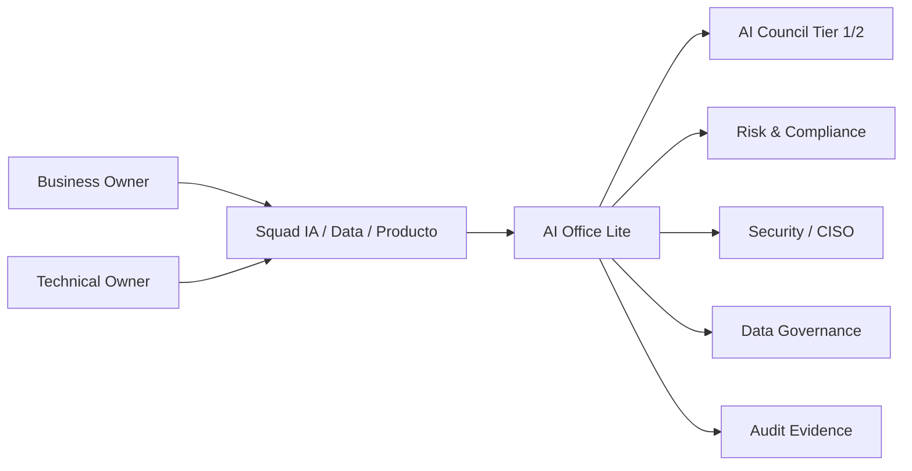

# Modelo operativo y RACI

> Nota: todos los ejemplos y registros usan datos simulados realistas para una fintech. No contienen datos productivos, PII real, PAN real, secretos, credenciales ni información confidencial.

# Objetivo

Definir un modelo de gobierno de IA liviano, compatible con squads ágiles y suficiente para una fintech regulada.

# Estructura propuesta

# Roles mínimos

| Rol | Responsabilidad |
|---|---|
| Business Owner | Define objetivo, impacto, aceptación del riesgo y valor esperado. |
| Technical Owner | Diseña solución, arquitectura, integración, seguridad técnica y operación. |
| Model Owner / Prompt Owner | Mantiene modelo/prompt, métricas, versiones y remediaciones. |
| Data Owner | Autoriza uso de datos, calidad, retención y clasificación. |
| Risk Owner | Evalúa riesgo inherente/residual y controles. |
| Security Owner | Evalúa amenazas, acceso, DLP, secretos, proveedores y logging. |
| AI Lead | Mantiene estándar, fast track, inventario, excepciones y dashboard. |
| Internal Audit | Revisa evidencia de forma independiente. |

# AI Office Lite

Equipo virtual, no necesariamente un área nueva. Debe tener representantes de:

- Arquitectura/Plataforma;
- Data/Analytics;
- Riesgos;
- Seguridad;
- Compliance/Legal;
- Producto/Negocio;
- Operaciones/Atención si hay impacto en cliente.

# AI Council

El AI Council se activa solo para casos que realmente lo requieren.

| Caso | Requiere AI Council |
|---|---:|
| Tier 1 | Sí |
| Tier 2 con impacto directo a cliente | Sí |
| Tier 2 interno sin PII crítica | Opcional |
| Tier 3 | No, fast track |
| Tier 4 | No, registro simple |
| Excepción crítica | Sí |
| Incidente Sev1/Sev2 | Sí |
| Vendor IA estratégico | Sí |

# Cadencia

| Ceremonia | Frecuencia | Duración sugerida | Objetivo |
|---|---|---:|---|
| AI Office triage | Semanal | 30 min | Clasificar nuevos casos y destrabar squads. |
| AI Council | Quincenal o bajo demanda | 45 min | Aprobar Tier 1/2, excepciones o incidentes. |
| AI Ops review | Mensual | 45 min | Revisar métricas, drift, incidentes y KPIs. |
| Auditoría de evidencia | Trimestral | 60 min | Verificar trazabilidad y controles. |

# RACI mínimo

| Actividad | Business Owner | Technical Owner | AI Lead | Risk | Security | Data Owner | Audit |
|---|---|---|---|---|---|---|---|
| Registrar caso IA | R | C | A | C | C | C | I |
| Clasificar riesgo | C | C | A | R | C | C | I |
| Aprobar Tier 1/2 | A | C | R | R | R | C | I |
| Aprobar Tier 3/4 | C | C | A/R | C | C | C | I |
| Aprobar datos | C | C | C | C | C | A/R | I |
| Validar modelo | C | R | A | R | C | C | I |
| Aprobar seguridad | I | R | C | C | A/R | C | I |
| Operar monitoreo | I | A/R | C | C | C | C | I |
| Gestionar incidente | A | R | R | R | R | C | I |
| Auditar evidencia | I | C | C | C | C | C | A/R |

# Derechos de decisión

| Decisión | Responsable final | Criterio de escalamiento |
|---|---|---|
| Priorización de portfolio IA | Business Owner + AI Lead | Valor alto o riesgo alto. |
| Aceptación de riesgo residual | Risk Owner | Tier 1/2 o excepción vencida. |
| Salida a producción | Technical Owner + AI Lead | Tier 1/2 va a AI Council. |
| Suspensión temporal | AI Lead + Risk/Security | Incidente, drift crítico o evidencia incompleta. |
| Retiro de modelo | Model Owner | Baja performance, obsolescencia o reemplazo. |

# Ejemplo de accountability

| Sistema | Business Owner | Technical Owner | Risk Owner | Data Owner |
|---|---|---|---|---|
| FRD-XGB-TRANSACTION-v3.2 | Gerencia Riesgo Transaccional | Lead Data Science Fraude | Riesgo Operacional | Data Owner Tarjetas |
| CSC-RAG-CLAIMS-v1.4 | Operaciones Cliente | Tech Lead Canales | Compliance Operativo | Data Owner Reclamos |
| AGT-OPS-RECON-v0.9 | Operaciones Backoffice | Lead Platform Automation | Riesgo Operacional | Data Owner Pagos |
