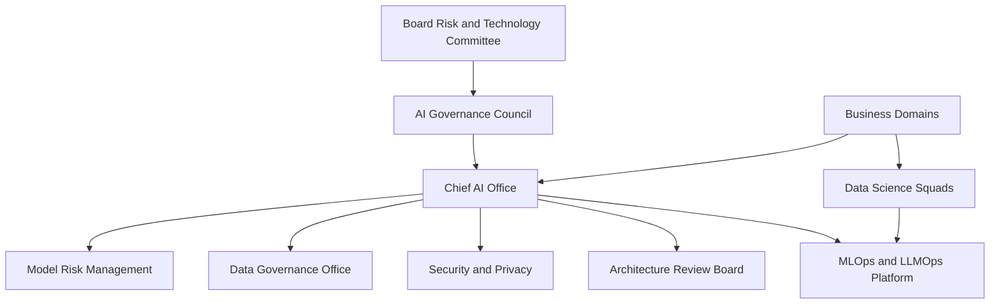

# AI Operating Model

# Objetivo

Definir cómo se organiza la empresa para gobernar, construir, aprobar, operar y auditar soluciones de IA.

# Modelo operativo

El modelo combina gobierno centralizado con ejecución federada por dominios de negocio.

# Componentes

## Chief AI Office

Responsable de la metodología, estándares, inventario, priorización y reporting ejecutivo.

## AI Governance Council

Comité multidisciplinario que aprueba políticas, casos críticos, excepciones y decisiones de alto impacto.

## Model Risk Management

Responsable de la validación independiente y evaluación de riesgo de modelos.

## Data Governance Office

Responsable de ownership, linaje, calidad, clasificación y uso autorizado de datos.

## MLOps / LLMOps Platform

Responsable de despliegue controlado, versionamiento, monitoreo, trazabilidad, rollback y automatización.

## Business Domains

Responsables de valor, definición funcional, aceptación de riesgo residual y resultados de negocio.

# Modelo federado

| Capa | Centralizado | Federado |
|---|---|---|
| Políticas | Chief AI Office | No |
| Priorización | AI Council | Business Domains proponen |
| Desarrollo | No | Squads de datos/IA |
| Validación | Model Risk | Apoyo de especialistas |
| Operación | Plataforma común | Ownership del modelo |
| Monitoreo | Estándares centralizados | Ejecución por dominio |

# Flujos operativos

## Intake

Todo caso de uso inicia con una ficha de intake.

## Clasificación de riesgo

El caso se clasifica según impacto en cliente, regulación, dinero, privacidad, seguridad y autonomía.

## Revisión de arquitectura

Arquitectura valida integración, datos, seguridad, resiliencia y operación.

## Validación independiente

Model Risk valida modelos de alto impacto antes de producción.

## Go Live

Solo se autoriza si existen evidencias completas.

# Cadencia de gobierno

| Reunión | Frecuencia | Objetivo |
|---|---|---|
| AI Council | Mensual | Decisiones ejecutivas |
| Model Risk Review | Quincenal | Validación de modelos |
| AI Architecture Review | Semanal | Diseño técnico |
| AI Incident Review | Bajo demanda | Incidentes críticos |
| Portfolio Review | Trimestral | Valor, riesgos y roadmap |

# Ejemplo realista

Un copiloto de atención al cliente que consulta políticas de contracargo se clasifica como riesgo alto si puede recomendar acciones que afecten reclamos. La ejecución es del dominio de Servicio al Cliente, pero la aprobación requiere AI Office, Legal, Seguridad y Arquitectura.
