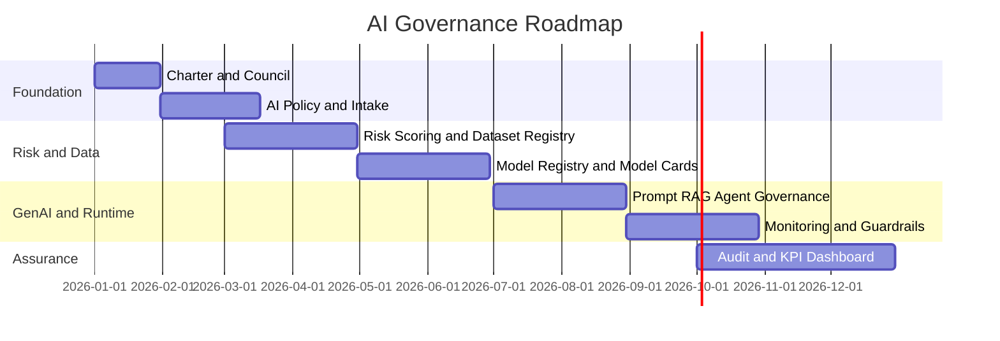

# AI Roadmap

# Objetivo

Definir una hoja de ruta de implementación del Gobierno de IA para una empresa regulada.

# Horizonte

El roadmap se organiza en 12 meses con madurez progresiva.

# Fase 0: Preparación ejecutiva

## Duración

0 a 30 días.

## Objetivos

- Nombrar sponsor ejecutivo.
- Definir Chief AI Office o función equivalente.
- Aprobar el AI Governance Charter.
- Crear inventario inicial de iniciativas IA.

## Entregables

- Charter aprobado.
- AI Council definido.
- Lista inicial de casos de uso.
- Matriz preliminar de riesgos.

# Fase 1: Foundation Governance

## Duración

1 a 3 meses.

## Objetivos

- Publicar AI Policy.
- Establecer proceso de intake.
- Crear RACI.
- Definir taxonomía de riesgo.
- Definir estándares mínimos para modelos y GenAI.

## Entregables

- AI Policy.
- AI Ethics Principles.
- AI Use Case Intake Process.
- Risk Scoring Matrix.
- AI Decision Rights RACI.

# Fase 2: Data, Risk and Model Governance

## Duración

3 a 6 meses.

## Objetivos

- Implementar dataset registry.
- Implementar model registry.
- Exigir model cards.
- Crear proceso de validación independiente.
- Activar controles de privacidad y calidad.

## Entregables

- Dataset Registry.
- Model Registry.
- Model Card Template.
- Model Approval Checklist.
- Data Quality Framework.

# Fase 3: GenAI, Agent and Runtime Governance

## Duración

6 a 9 meses.

## Objetivos

- Gobernar prompts, RAG y agentes.
- Implementar guardrails.
- Definir human-in-the-loop.
- Monitorear drift, hallucination y seguridad.

## Entregables

- Prompt Governance.
- RAG Governance.
- Agent Governance.
- Guardrails Standard.
- Monitoring Standard.

# Fase 4: Continuous Assurance

## Duración

9 a 12 meses.

## Objetivos

- Automatizar evidencias.
- Integrar auditoría continua.
- Medir valor y riesgo.
- Reducir excepciones.

## Entregables

- Audit Framework.
- Evidence Requirements.
- Governance Dashboard.
- Value Realization.
- Incident Management Runbook.

# Roadmap visual

# Priorización sugerida

| Mes | Prioridad |
|---:|---|
| 1 | Inventario y comité |
| 2 | Política e intake |
| 3 | Clasificación de riesgo |
| 4 | Dataset registry |
| 5 | Model cards |
| 6 | Validación independiente |
| 7 | Guardrails GenAI |
| 8 | Agent governance |
| 9 | Monitoreo y drift |
| 10 | Auditoría continua |
| 11 | KPIs de valor |
| 12 | Optimización |
