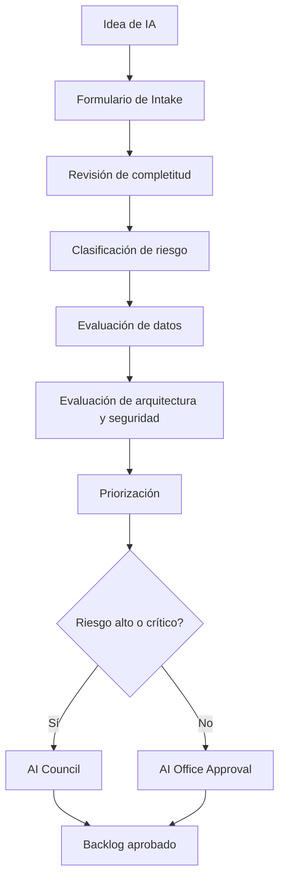

# AI Use Case Intake Process

# Objetivo

Definir el proceso obligatorio para registrar, evaluar y priorizar casos de uso de IA antes de desarrollo, compra o despliegue.

# Flujo



# Formulario de intake

## Información general

| Campo | Ejemplo |
|---|---|
| Nombre del caso | Modelo de detección de fraude ecommerce |
| Área solicitante | Riesgo Transaccional |
| Sponsor | Gerente de Riesgos |
| Business Owner | Product Owner Fraude |
| Tipo de IA | Machine Learning supervisado |
| Estado | Idea / Discovery / Piloto / Producción |

## Problema de negocio

| Pregunta | Ejemplo |
|---|---|
| ¿Qué problema resuelve? | Reducir fraude ecommerce y falsos positivos |
| ¿Qué decisión apoya? | Autorizar, retener o revisar transacción |
| ¿A quién impacta? | Clientes tarjeta, comercios, operaciones |
| ¿Cuál es el beneficio esperado? | Reducir pérdidas por fraude 15-20% |

## Datos

| Campo | Ejemplo |
|---|---|
| Fuentes | Transacciones, contracargos, device fingerprint, merchant risk |
| PII | Sí |
| Datos sensibles | PAN tokenizado, ubicación, comportamiento transaccional |
| Retención | 5 años según política |
| Owner de datos | Data Owner de Tarjetas |

## Riesgo preliminar

| Pregunta | Respuesta |
|---|---|
| ¿Afecta clientes? | Sí |
| ¿Afecta acceso a productos o dinero? | Sí |
| ¿Puede generar reclamos? | Sí |
| ¿Tiene decisión automatizada? | Parcial |
| Riesgo preliminar | Crítico |

# Criterios de aceptación para pasar a discovery

- Sponsor identificado.
- Business case preliminar.
- Datos fuente identificados.
- Riesgo preliminar asignado.
- No contradice AI Policy.
- Existe capacidad técnica o vendor viable.

# Ejemplo de intake completo

```yaml
use_case_id: AI-UC-2026-001
name: Detección de fraude en transacciones ecommerce
business_domain: Riesgo Transaccional
ai_type: supervised_ml
expected_value_pen_year: 39690000
customer_impact: high
regulatory_impact: high
data_sources:
  - card_transactions
  - chargebacks
  - merchant_risk
  - device_risk
pii: true
automated_decision: partial
human_review: true
risk_tier: Tier 1
required_approvals:
  - AI Office
  - CISO
  - Compliance
  - Model Risk
  - AI Council
```

# SLA del proceso

| Actividad | SLA |
|---|---:|
| Revisión de completitud | 5 días hábiles |
| Clasificación de riesgo | 10 días hábiles |
| Revisión de arquitectura | 10 días hábiles |
| Revisión AI Council | Próxima sesión mensual |

# Salidas del proceso

- Caso aprobado para discovery.
- Caso devuelto por información incompleta.
- Caso rechazado por riesgo inaceptable.
- Caso derivado a AI Council.
- Caso convertido en piloto controlado.
