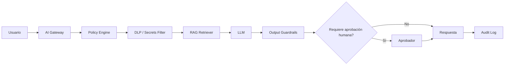

# Gobierno de GenAI, RAG y agentes

# Objetivo

Definir controles mínimos para copilotos, RAGs y agentes de IA, 
manteniendo trazabilidad y seguridad sin separar múltiples documentos.

# Tipos de soluciones GenAI

| Tipo | Ejemplo fintech | Control clave |
|---|---|---|
| Copiloto interno | Ayuda a analistas de reclamos | DLP + fuentes aprobadas + feedback |
| RAG interno | Consultas sobre normas, políticas y procedimientos | groundedness + trazabilidad de fuentes |
| RAG cliente | Responde preguntas de productos | revisión de respuestas + disclaimers + HITL |
| Agente A1 | Consulta CRM o tickets | RBAC + minimización + logs |
| Agente A2 | Propone acciones o drafts | aprobación humana |
| Agente A3 | Ejecuta acción reversible | policy engine + límites + aprobación |
| Agente A4 | Acción irreversible o financiera | prohibido por defecto salvo aprobación extraordinaria |

# Niveles de autonomía

| Nivel | Descripción | Ejemplo | Requisito |
|---|---|---|---|
| A0 | Solo responde información | resumen de documento | logging básico |
| A1 | Usa herramientas de lectura | consulta estado de reclamo | RBAC y masking |
| A2 | Recomienda o redacta | draft de respuesta | aprobación humana antes de enviar |
| A3 | Ejecuta acción reversible | crea ticket, agenda tarea | límites, policy engine y auditoría |
| A4 | Ejecuta acción crítica | bloquea tarjeta, ajusta límite | no permitido por defecto |

# Prompt/RAG Card Lite

| Campo | Ejemplo simulado |
|---|---|
| System ID | CSC-RAG-CLAIMS-v1.4 |
| Caso | AI-UC-2026-003 Copiloto reclamos de tarjeta |
| Owner | Operaciones Cliente |
| Modelo | LLM privado vía AI Gateway |
| Fuentes RAG | manual reclamos v2026.05, política chargeback v2026.04, matriz SLA v2026.01 |
| Datos permitidos | ticket ID, categoría, estado, extractos minimizados |
| Datos bloqueados | PAN completo, CVV, credenciales, tokens, datos no necesarios |
| Grounding esperado | >= 94% |
| Hallucination rate máximo | <= 3% |
| Human approval | requerido antes de enviar respuesta a cliente |
| Retención logs | 180 días con masking |

# Controles RAG

| Control | Descripción | Evidencia |
|---|---|---|
| RAG-001 | Fuentes aprobadas y versionadas | knowledge base inventory |
| RAG-002 | Chunking y embeddings reproducibles | pipeline config |
| RAG-003 | Respuesta con citas internas o trazabilidad | response log |
| RAG-004 | Evaluación de groundedness y relevancia | rag evaluation report |
| RAG-005 | Detección de PII y secretos | DLP logs |
| RAG-006 | Control de documentos vencidos | freshness check |

# Controles de agentes

| Control | Descripción | Evidencia |
|---|---|---|
| AGT-001 | Registro de herramientas permitidas | tool registry |
| AGT-002 | Permisos mínimos por herramienta | RBAC matrix |
| AGT-003 | Bloqueo de acciones críticas | policy rules |
| AGT-004 | Aprobación humana para A2/A3 | approval log |
| AGT-005 | Rate limits y límites monetarios/operativos | runtime config |
| AGT-006 | Kill switch y rollback | runbook |
| AGT-007 | Logs de razonamiento operativo resumido, no cadenas internas sensibles | audit log |

# Ejemplo de agente simulado

```json
{
  "agent_id": "AGT-OPS-RECON-v0.9",
  "use_case_id": "AI-UC-2026-005",
  "autonomy_level": "A2",
  "purpose": "Analizar diferencias de conciliación y proponer tareas de corrección",
  "allowed_tools": [
    "read_reconciliation_batch",
    "read_payment_status",
    "create_backoffice_task",
    "draft_adjustment_request"
  ],
  "blocked_tools": [
    "execute_refund",
    "change_ledger_entry",
    "release_payment_hold"
  ],
  "human_approval_required": true,
  "max_batch_amount_pen": 50000,
  "kill_switch_owner": "AI Operations Lead"
}
```

# Evaluación mínima GenAI

| Métrica | Umbral warning | Umbral crítico | Acción |
|---|---:|---:|---|
| Groundedness | < 94% | < 90% | revisar fuentes/chunking |
| Hallucination rate | > 3% | > 8% | bloquear release o rollback |
| PII leakage | > 0 | > 0 | bloqueo y RCA |
| Prompt injection blocked | < 98% | < 95% | reforzar guardrails |
| Tool misuse | > 0 | > 0 | suspender herramienta |
| Human override rate | > 15% | > 25% | revisar calidad o workflow |

# Patrones recomendados



# Reglas de prompts

- Versionar system prompt y herramientas disponibles.
- Registrar cambios relevantes como pull request o ticket.
- Probar contra casos adversariales antes de producción.
- No incluir secretos ni datos sensibles innecesarios.
- Mantener prompts críticos fuera del código del frontend.
- Usar evaluación automatizada y revisión humana para cambios Tier 1/2.
