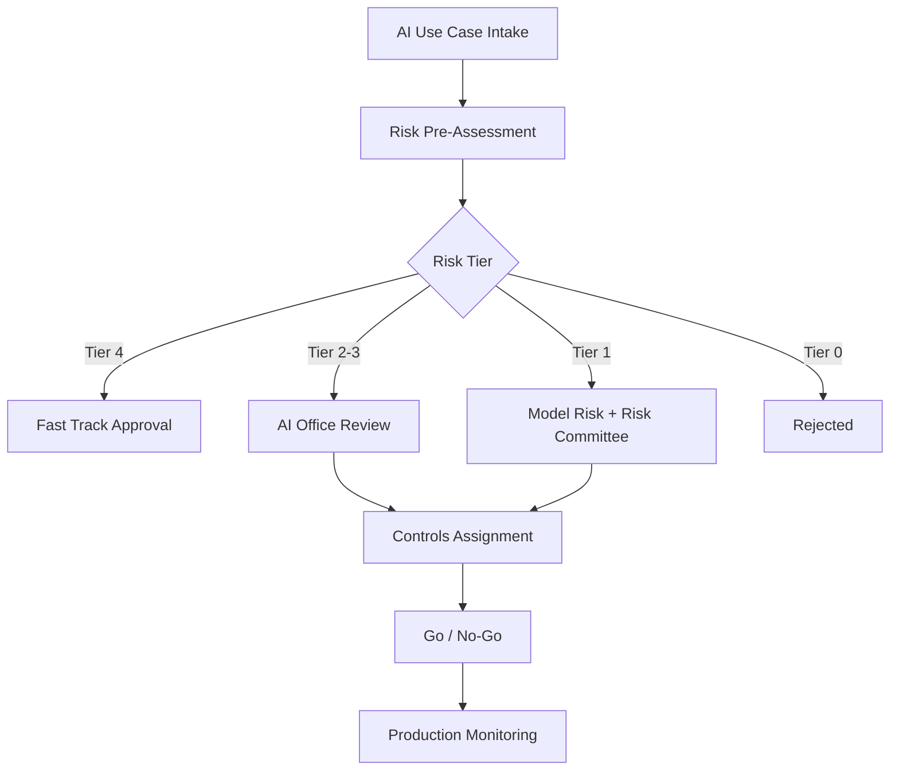

# AI Risk Framework

# Propósito

Definir la metodología corporativa para identificar, clasificar, evaluar, aprobar y monitorear riesgos de sistemas de inteligencia artificial en empresas reguladas.

# Marcos usados

## NIST AI RMF

Se usa como ciclo principal de gestión:

| Función | Uso en el framework |
|---|---|
| Govern | políticas, roles, comité, accountability |
| Map | contexto, impacto, usuarios afectados |
| Measure | pruebas, métricas, bias, robustez |
| Manage | mitigación, aceptación, monitoreo |

## ISO 42001

Se usa como sistema de gestión de IA: objetivos, controles, auditoría, mejora continua y evidencia.

## EU AI Act

Se usa para clasificar riesgo por impacto: prohibido, alto riesgo, riesgo limitado y riesgo mínimo.

## SR 11-7 / Model Risk Management

Se usa para modelos que impactan crédito, fraude, provisiones, precios, límites o decisiones financieras.

# Clasificación de riesgo

| Tier | Riesgo | Criterio | Ejemplos |
|---|---|---|---|
| Tier 0 | Prohibido | práctica no aceptable | manipulación, discriminación, uso oculto de PII |
| Tier 1 | Crítico | decisión financiera o legal | originación de crédito, fraude, límites |
| Tier 2 | Alto | impacto operacional o cliente | cobranzas, copilot de atención, KYC OCR |
| Tier 3 | Medio | recomendación asistida | marketing, propensión, next best action |
| Tier 4 | Bajo | productividad interna | resumen, clasificación documental interna |

# Criterios de evaluación

| Dimensión | Pregunta clave | Peso sugerido |
|---|---|---:|
| Impacto en cliente | ¿Afecta acceso a producto, dinero, reclamo o atención? | 20% |
| Autonomía | ¿La IA decide o solo recomienda? | 15% |
| Datos sensibles | ¿Usa PII, datos financieros, biometría o salud? | 15% |
| Regulación | ¿Está sujeto a SBS, privacidad, PCI, AML o auditoría? | 15% |
| Explicabilidad | ¿Se puede explicar la decisión? | 10% |
| Robustez | ¿Tolera drift, ataques, errores y datos incompletos? | 10% |
| Seguridad | ¿Puede filtrar datos, prompts o secrets? | 10% |
| Terceros | ¿Depende de proveedor externo o modelo cerrado? | 5% |

# Ejemplo realista de evaluación

Caso: motor de fraude transaccional para tarjetas.

| Campo | Valor |
|---|---|
| Canal | POS, e-commerce, card-not-present |
| Decisión | aprobar, retener, desafiar o rechazar transacción |
| Datos | monto, MCC, comercio, país, dispositivo, velocity, historial de contracargos |
| Riesgo | Tier 1 |
| Justificación | puede afectar disponibilidad de fondos y experiencia del cliente |
| Control mínimo | validación independiente, explainability, monitoreo, rollback, auditoría |

# Workflow de riesgo

# Evidencia obligatoria

| Evidencia | Tier 1 | Tier 2 | Tier 3 | Tier 4 |
|---|---:|---:|---:|---:|
| Use case assessment | Sí | Sí | Sí | Sí |
| Data lineage | Sí | Sí | Parcial | No |
| Model card | Sí | Sí | Sí | No |
| Bias test | Sí | Sí | Según caso | No |
| Security review | Sí | Sí | Sí | Según caso |
| Human-in-the-loop | Sí | Según caso | Según caso | No |
| Independent validation | Sí | Según caso | No | No |
| Production monitoring | Sí | Sí | Sí | No |

# Política de aceptación de riesgo

Ningún sistema Tier 1 puede pasar a producción sin aprobación formal de AI Office, Risk, Compliance, Security y el dueño de negocio.
