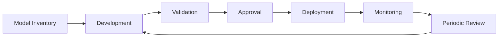

# Model Risk Management

# Propósito

Definir el marco de gestión de riesgo de modelos analíticos, machine learning y GenAI usados en decisiones de negocio, riesgo, crédito, fraude, cobranza, pricing o cumplimiento.

# Principio rector

Un modelo no es solo código. Es una combinación de datos, supuestos, entrenamiento, validación, operación, monitoreo y decisiones humanas.

# Taxonomía de modelos

| Tipo | Ejemplo | Riesgo típico |
|---|---|---|
| Scorecard estadístico | admisión crediticia | sesgo, drift, baja explicabilidad |
| ML supervisado | fraude con XGBoost | falsos positivos, drift, ataques |
| Deep learning | OCR de documentos | errores en imagen, sesgo por calidad |
| LLM | copilot interno | alucinación, fuga de datos |
| Agente IA | agente de reclamos | autonomía excesiva, acciones no autorizadas |

# Ciclo MRM

# Tres líneas de defensa

| Línea | Responsable | Función |
|---|---|---|
| 1ra línea | negocio + data science | desarrollo, uso y monitoreo diario |
| 2da línea | riesgo, compliance, AI Office | políticas, challenge, validación de riesgo |
| 3ra línea | auditoría interna | assurance independiente |

# Validación independiente

Obligatoria para modelos Tier 1.

## Pruebas mínimas

| Prueba | Descripción |
|---|---|
| Conceptual soundness | supuestos, variable selection, objetivo |
| Data quality | completitud, consistencia, leakage |
| Backtesting | performance histórica |
| Sensitivity analysis | estabilidad ante cambios |
| Bias/fairness | diferencias por segmentos relevantes |
| Explainability | SHAP, PDP, reason codes |
| Operational readiness | latencia, resiliencia, fallback |

# Ejemplo realista: modelo de fraude

Variables típicas observadas en datasets públicos de fraude transaccional y en operación bancaria:

| Feature | Tipo | Uso |
|---|---|---|
| transaction_amount | numérico | detectar outliers |
| merchant_category_code | categórico | riesgo por rubro |
| device_id_reuse_count | numérico | fraude por dispositivo compartido |
| card_present_flag | binario | POS vs CNP |
| velocity_5m | numérico | ráfagas de transacciones |
| geo_distance_last_tx_km | numérico | anomalía geográfica |
| chargeback_rate_merchant_90d | numérico | riesgo histórico del comercio |

# Criterio de aprobación

| Métrica | Umbral mínimo sugerido |
|---|---:|
| AUC | >= 0.85 |
| Recall fraude | >= 0.80 |
| False positive rate | <= apetito de negocio |
| Latencia P95 | <= 50 ms |
| PSI mensual feature crítica | < 0.25 |

# Política de revalidación

| Condición | Acción |
|---|---|
| cambio mayor de datos | revalidación completa |
| drift crítico | recalibración o rollback |
| cambio regulatorio | revisión de compliance |
| degradación de performance | retraining o reemplazo |
| incidente Sev1 | suspensión o modo manual |
