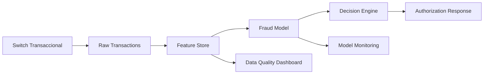

# Data Lineage Standard

# Propósito

Definir el estándar de trazabilidad para datos usados por IA desde origen hasta decisión, explicación, monitoreo y auditoría.

# Niveles de lineage

| Nivel | Descripción | Obligatorio para |
|---|---|---|
| L1 Sistema | origen y consumidor | todos |
| L2 Dataset | tablas, buckets, documentos | Tier 1-3 |
| L3 Campo | columnas/features críticas | Tier 1-2 |
| L4 Transformación | reglas, joins, agregaciones | Tier 1 |

# Elementos requeridos

| Elemento | Descripción |
|---|---|
| Source system | sistema origen |
| Data contract | estructura esperada |
| Transformation | regla aplicada |
| Feature | variable de modelo |
| Model | versión del modelo |
| Decision | salida usada por negocio |
| Log | evidencia de inferencia |

# Ejemplo: feature velocity_5m

```text
Source: transactions_authorization
Transformación: count(transaction_id) by card_token in last 5 minutes
Feature: velocity_5m
Modelo: fraud-xgb-v3.2
Decisión: approve / challenge / decline
```

# Diagrama



# Lineage para RAG

En GenAI, el lineage debe cubrir documentos y chunks.

| Elemento | Ejemplo |
|---|---|
| Documento fuente | política de reclamos v2026.04 |
| Owner | Legal / Operaciones |
| Fecha de vigencia | 2026-04-01 |
| Chunk ID | claims-policy-v2026.04-c023 |
| Embedding model | text-embedding-vX |
| Vector index | customer-support-kb-prod |
| Respuesta generada | ID de conversación |

# Controles

- Todo feature crítico debe mapearse a origen.
- Toda respuesta GenAI regulada debe poder citar fuente.
- No se permite usar datasets huérfanos sin owner.
- Cambios de transformación deben versionarse.
