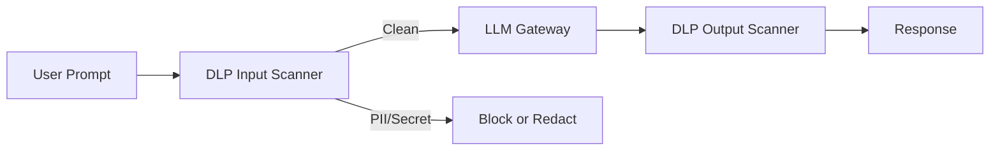

# PII Protection Standard

# Propósito

Proteger datos personales, financieros y sensibles usados en IA, ML, GenAI y analítica avanzada.

# Datos protegidos

| Tipo | Ejemplo | Tratamiento |
|---|---|---|
| Identidad | DNI, nombre, email, teléfono | minimización + masking |
| Tarjeta | PAN, CVV, expiración | tokenización / prohibido en GenAI |
| Financiero | saldo, deuda, línea, mora | cifrado + RBAC |
| Dispositivo | fingerprint, IP, geolocalización | pseudonimización |
| Conversación | chats, reclamos, audios | redacción de PII |

# Reglas

## PAN

```text
No permitido: 4557880012345678
Permitido: 455788******5678
Permitido: card_token=tok_card_8f27a9
```

## DNI

```text
No permitido en prompts externos: 76543210
Permitido para pruebas: dni_hash=sha256(...)
```

## Logs

Los logs de IA no deben guardar:

- PAN completo
- CVV
- contraseña
- token JWT completo
- refresh token
- API keys
- prompts con PII no minimizada

# Control DLP para GenAI



# Ejemplo realista de redacción

## Prompt original

```text
El cliente Juan Pérez con DNI 76543210 y tarjeta 4557880012345678 reclama una compra de S/ 1,200.
```

## Prompt permitido

```text
Cliente con identidad verificada y tarjeta tokenizada reclama una compra de S/ 1,200. Usa la política de reclamos vigente para orientar al asesor.
```

# Evidencia requerida

- reporte DLP
- política de masking
- configuración de tokenización
- prueba de no fuga de PII
- revisión de privacidad
- aprobación de Legal/Compliance para usos Tier 1/2
