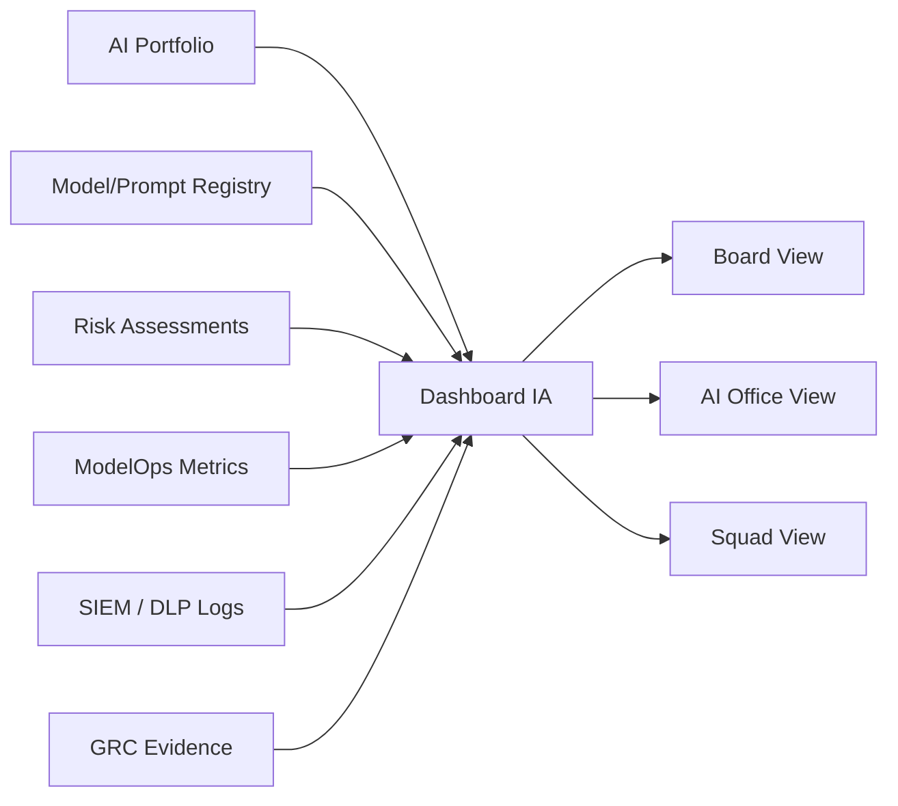

# KPIs y dashboard de gobierno de IA

# Objetivo

Definir métricas ejecutivas y operativas para demostrar valor, control, seguridad y cumplimiento del portfolio de IA.

# Vista ejecutiva

| KPI | Valor simulado | Meta | Estado |
|---|---:|---:|---|
| Casos IA registrados | 8 | 100% identificados | OK |
| Casos productivos | 2 | seguimiento mensual | OK |
| Casos Tier 1/2 con Release Pack | 5/5 | 100% | OK |
| Excepciones vencidas | 0 | 0 | OK |
| Incidentes Sev1 abiertos | 0 | 0 | OK |
| Valor anual estimado portfolio | PEN 27.1MM | > PEN 20MM | OK |
| Valor realizado YTD | PEN 8.9MM | según plan | Warning |
| Modelos con monitoreo activo | 6/6 | 100% | OK |

# Portfolio por tier

| Tier | Cantidad | Productivo | En delivery | Comentario |
|---|---:|---:|---:|---|
| Tier 1 | 2 | 1 | 1 | Fraude y scoring alternativo |
| Tier 2 | 3 | 0 | 3 | Reclamos, conciliaciones, KYC/OCR, mora |
| Tier 3 | 2 | 2 | 0 | RAG normativo y cross-sell |
| Tier 4 | 1 | 0 | 1 | clasificación interna |

# Vista de riesgo

| Riesgo | Bajo | Medio | Alto | Crítico | Acción |
|---|---:|---:|---:|---:|---|
| Datos | 2 | 3 | 3 | 0 | revisar PII en copiloto y KYC |
| Modelo | 1 | 4 | 2 | 1 | validación fraude/scoring |
| Seguridad | 3 | 3 | 2 | 0 | reforzar DLP y supply chain |
| GenAI/Agentes | 1 | 2 | 1 | 0 | pruebas adversariales |
| Compliance | 2 | 4 | 2 | 0 | completar evidence links |

# Vista de valor

| Caso | Valor esperado anual | Valor realizado YTD | % avance | Métrica negocio |
|---|---:|---:|---:|---|
| Fraude CNP | PEN 7.8MM | PEN 3.2MM | 41% | pérdida evitada |
| Cross-sell préstamos | PEN 3.2MM | PEN 2.1MM | 66% | uplift neto |
| RAG compliance | PEN 0.8MM | PEN 0.5MM | 63% | horas ahorradas |
| Copiloto reclamos | PEN 1.6MM | PEN 0.0MM | 0% | piloto en curso |
| Agente conciliaciones | PEN 2.1MM | PEN 0.4MM | 19% | tareas automatizadas |

# Vista ModelOps

| Sistema | Métrica principal | Último valor | Umbral | Estado |
|---|---|---:|---:|---|
| FRD-XGB-TRANSACTION-v3.2 | Recall fraude | 0.887 | >= 0.850 | OK |
| FRD-XGB-TRANSACTION-v3.2 | FPR | 1.6% | <= 2.0% | OK |
| CSC-RAG-CLAIMS-v1.4 | Groundedness | 95.8% | >= 94% | OK |
| CSC-RAG-CLAIMS-v1.4 | Hallucination | 2.1% | <= 3% | OK |
| AGT-OPS-RECON-v0.9 | Human override | 12.4% | <= 15% | OK |
| MKT-PROP-XSELL-v2.4 | Uplift | 7.8% | >= 5% | OK |

# Vista de cumplimiento

| Control | Cobertura | Meta | Estado |
|---|---:|---:|---|
| Casos registrados | 8/8 | 100% | OK |
| Risk assessment vigente | 8/8 | 100% | OK |
| Model/GenAI card vigente | 6/6 | 100% | OK |
| Data review si usa PII | 5/5 | 100% | OK |
| Security review Tier 1/2 | 5/5 | 100% | OK |
| Monitoreo activo productivos | 3/3 | 100% | OK |
| Incidentes con RCA cerrado | 2/2 | 100% | OK |

# Métricas mínimas por audiencia

| Audiencia | Métricas | Frecuencia |
|---|---|---|
| Directorio / Comité Riesgos | valor, Tier 1/2, incidentes, excepciones | trimestral |
| AI Office | portfolio, controles, evidencias, riesgos | mensual |
| CISO | DLP, prompt injection, secrets, tool abuse | mensual |
| CRO / Compliance | riesgo residual, validaciones, hallazgos | mensual |
| Squads | métricas técnicas, alertas, release readiness | semanal |

# Diagrama de dashboard

