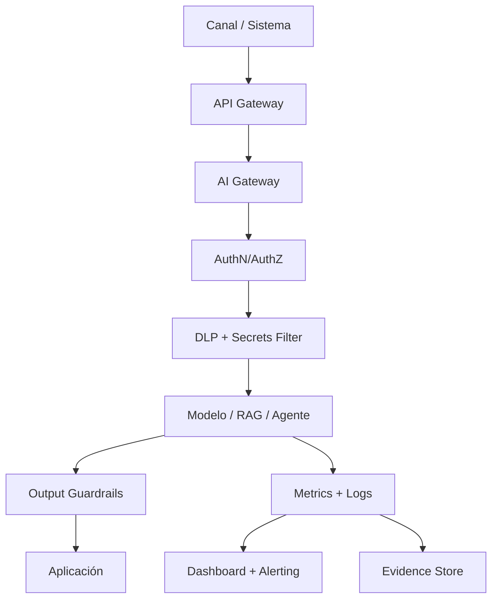

# Seguridad, ModelOps y evidencias

> Nota: todos los ejemplos y registros usan datos simulados realistas para una fintech. No contienen datos productivos, PII real, PAN real, secretos, credenciales ni información confidencial.

# Objetivo

Consolidar seguridad IA, operación, monitoreo, incidentes y evidencia auditable en un solo documento práctico.

# Arquitectura mínima de control



# Controles de seguridad IA

| ID | Control | Descripción | Evidencia |
|---|---|---|---|
| SEC-001 | Autenticación fuerte | OAuth/OIDC/mTLS para servicios IA | arquitectura + config |
| SEC-002 | Autorización por propósito | acceso según rol, dominio y caso | RBAC/ABAC matrix |
| SEC-003 | DLP y masking | bloquear PII/PCI/secretos en prompts y logs | DLP logs |
| SEC-004 | Segregación ambientes | dev/test/prod aislados | environment matrix |
| SEC-005 | Supply chain IA | revisar modelos, librerías, containers y vendors | security scan |
| SEC-006 | Prompt injection defense | filtros, delimitadores, tool policy, eval adversarial | red team report |
| SEC-007 | Logging seguro | logs sin secretos ni datos sensibles innecesarios | log sample |
| SEC-008 | Kill switch | apagado de modelo, prompt, agente o tool | runbook |

# Monitoreo mínimo

| Capa | Métrica | Tier 1/2 | Tier 3/4 |
|---|---|---:|---:|
| Plataforma | disponibilidad, errores, p95 latency | continuo | diario/semanal |
| Datos | missing, outliers, freshness, PSI | diario/semanal | semanal/mensual |
| Modelo ML | recall, precision, AUC, FPR, calibración | semanal/mensual | mensual |
| GenAI/RAG | groundedness, hallucination, PII leakage | semanal | mensual |
| Agentes | tool calls, blocked actions, approvals, overrides | continuo | semanal |
| Negocio | fraude evitado, ahorro, conversión, SLA | mensual | mensual |
| Riesgo | incidentes, excepciones, hallazgos | mensual | mensual |

# Umbrales sugeridos

| Métrica | Warning | Crítico | Acción |
|---|---:|---:|---|
| PSI feature crítica | > 0.10 | > 0.25 | análisis / retraining / rollback |
| Caída recall | > 3 pp | > 7 pp | análisis / AI Council si Tier 1 |
| FPR fraude | > apetito + 10% | > apetito + 25% | ajustar threshold / rollback |
| P95 latency | > SLA | > 2x SLA | escalar plataforma |
| Hallucination rate | > 3% | > 8% | bloquear release / ajustar RAG |
| PII leakage | > 0 | > 0 | incidente de seguridad |
| Tool misuse | > 0 | > 0 | deshabilitar tool |

# Gestión de incidentes IA

| Severidad | Criterio | Ejemplo | Respuesta |
|---|---|---|---|
| Sev1 | impacto financiero, clientes masivos, PII/PCI o acción crítica errónea | modelo rechaza transacciones válidas masivamente | suspensión, war room, RCA |
| Sev2 | impacto limitado o degradación fuerte | alucinación en copiloto con respuesta no enviada | rollback o hotfix |
| Sev3 | alerta sin impacto confirmado | drift warning | análisis y seguimiento |
| Sev4 | hallazgo menor | documentación vencida | backlog de remediación |

# Evidence store

La evidencia no debe vivir en correos. Debe estar en repositorio auditable.

| Evidencia | Repositorio sugerido | Retención sugerida |
|---|---|---:|
| Intake y approvals | Jira/GRC/ServiceNow | 5 años |
| Código, prompts y configs | Git | vida del sistema + 2 años |
| Model registry | MLflow/Vertex/SageMaker | vida del modelo + 5 años |
| Dataset card y lineage | Data Catalog | según política datos |
| Métricas y dashboards | Grafana/Datadog | 13-24 meses online |
| Logs de auditoría | SIEM/OpenSearch/Loki | según criticidad |
| Incidentes y RCA | GRC/SIEM | 5 años |
| Excepciones | GRC/Jira | hasta cierre + 5 años |

# AI Release Pack

| Sección | Contenido mínimo |
|---|---|
| 1. Intake | caso, owner, objetivo, beneficio, estado |
| 2. Risk | tier, score, riesgos, aceptación residual |
| 3. Data | fuentes, propósito, PII/PCI, calidad, lineage |
| 4. Model/GenAI | model card, prompt card, RAG card o agent card |
| 5. Security | threat model, DLP, secretos, vendor, accesos |
| 6. Validation | métricas, pruebas, sesgo, robustez, aprobación |
| 7. Operation | dashboard, umbrales, incident runbook, rollback |
| 8. Evidence | links a tickets, repos, dashboards y aprobaciones |

# Ejemplo de evento operativo

```json
{
  "event_id": "AI-OPS-2026-000184",
  "system_id": "FRD-XGB-TRANSACTION-v3.2",
  "window": "2026-06-24/2026-06-30",
  "tier": "Tier 1",
  "recall": 0.887,
  "precision": 0.941,
  "false_positive_rate": 0.016,
  "psi_amount": 0.18,
  "p95_latency_ms": 32,
  "alert": "data_drift_warning",
  "owner": "Lead Data Science Fraude",
  "action": "monitoring_extended_for_7_days"
}
```

# Revisión periódica

| Frecuencia | Revisión | Responsable |
|---|---|---|
| Semanal | alertas Tier 1/2, incidentes abiertos | AI Ops |
| Mensual | dashboard gobierno, excepciones, valor | AI Office |
| Trimestral | evidencia audit-ready y controles | Audit + Risk |
| Semestral | vigencia de modelos Tier 1/2 | Model Owner + Risk |
| Anual | política, apetito de riesgo, framework | AI Council |
