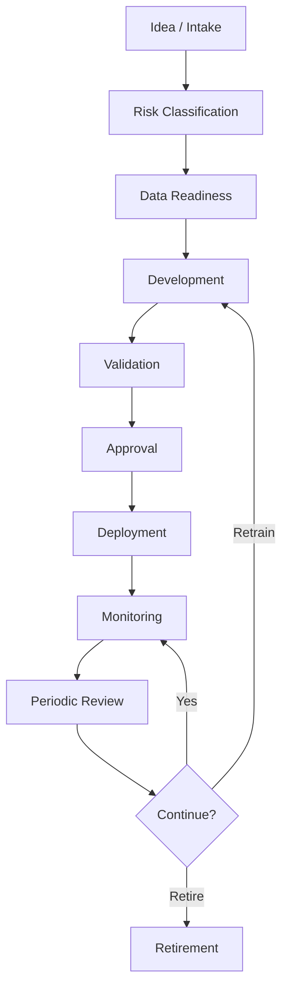

# Model Lifecycle

# Propósito

Definir el ciclo de vida estándar para modelos de IA desde ideación hasta retiro.

# Fases

# Entregables por fase

| Fase | Entregables |
|---|---|
| Intake | ficha de caso, sponsor, valor esperado |
| Risk Classification | risk score, tier, controles mínimos |
| Data Readiness | dataset registry, lineage, quality report |
| Development | experiment tracking, código, features |
| Validation | validation report, bias, explainability |
| Approval | model card, checklist, acta |
| Deployment | release notes, rollback, SLOs |
| Monitoring | drift, performance, incidents |
| Review | revalidación, decisión de continuidad |
| Retirement | plan de retiro, archivo de evidencia |

# Definition of Done

Un modelo no está listo para producción hasta cumplir:

- caso registrado
- owner de negocio y técnico
- riesgo clasificado
- dataset registrado
- model card aprobado
- métricas validadas
- seguridad revisada
- monitoreo configurado
- rollback definido
- auditoría habilitada

# Ejemplo: modelo de cobranza

| Fase | Ejemplo |
|---|---|
| Intake | priorizar clientes por probabilidad de pago |
| Datos | historial de pagos, mora, contacto, promesas cumplidas |
| Modelo | ranking propensity-to-pay |
| Validación | lift por decil, sesgo por segmento, estabilidad mensual |
| Producción | recomendación al gestor, no acción automática agresiva |
| Monitoreo | tasa de contacto, recuperación, quejas, drift |

# Política de retiro

Un modelo debe retirarse cuando:

- existe reemplazo aprobado
- performance cae bajo umbral por 2 ciclos
- datos origen cambian sustancialmente
- regulación o política interna lo prohíbe
- presenta incidente crítico no mitigable
