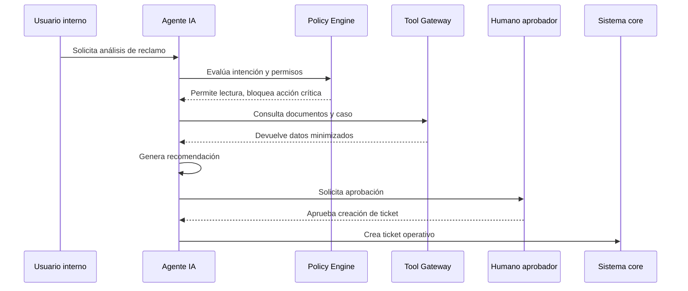

# Gobierno de Agentes de IA

# Propósito

Definir controles para agentes que planifican, invocan herramientas, consultan sistemas, ejecutan acciones o recomiendan decisiones. El objetivo es habilitar automatización con límites claros de autonomía, supervisión y responsabilidad.

# Niveles de autonomía

| Nivel | Descripción | Ejemplo | Requiere humano |
|---|---|---|---|
| A0 | asistente informativo | resumen de documentos | no |
| A1 | asistente con herramientas de lectura | consulta CRM | según datos |
| A2 | propone acción | draft de respuesta | sí antes de enviar |
| A3 | ejecuta acción reversible | crear ticket | sí por política |
| A4 | ejecuta acción irreversible | bloquear tarjeta | siempre |

# Regla corporativa

Ningún agente A3/A4 puede operar en producción sin:

- inventario registrado,
- owner de negocio,
- matriz de riesgo,
- herramientas permitidas,
- límites de ejecución,
- logs trazables,
- kill switch,
- revisión humana para acciones críticas.

# Ejemplo realista

Agente de reclamos de tarjeta.

```json
{
  "agent_id": "AGT-CLAIMS-CHARGEBACK-001",
  "autonomy_level": "A2",
  "allowed_tools": [
    "read_customer_case",
    "retrieve_policy_documents",
    "draft_customer_response",
    "create_internal_task"
  ],
  "blocked_tools": [
    "refund_transaction",
    "block_card",
    "change_credit_limit"
  ],
  "human_approval_required": true,
  "kill_switch_owner": "AI Operations Lead"
}
```

# Tool governance

| Tool | Riesgo | Control |
|---|---|---|
| read_customer_profile | alto | RBAC + masking |
| read_transactions | alto | minimización + auditoría |
| create_ticket | medio | rate limit |
| send_email | alto | aprobación humana |
| block_card | crítico | no permitido para agente autónomo |

# Secuencia operativa



# Controles mínimos

| Control | Descripción |
|---|---|
| AGT-001 | declaración de herramientas permitidas |
| AGT-002 | policy engine antes de cada tool call |
| AGT-003 | límites de costo y rate limit |
| AGT-004 | memoria del agente restringida |
| AGT-005 | evaluación adversarial antes de producción |
| AGT-006 | human-in-the-loop para decisiones críticas |
