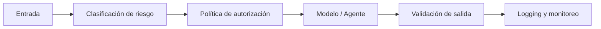

# Estándar de Guardrails para IA

# Propósito

Establecer barreras técnicas y operativas para prevenir uso inseguro, fuga de datos, respuestas no fundamentadas, sesgo, abuso de herramientas y acciones no autorizadas.

# Capas de guardrails



# Guardrails de entrada

| Control | Ejemplo |
|---|---|
| detección de PII | DNI, correo, teléfono |
| detección PCI | PAN, CVV, fecha de vencimiento |
| prompt injection | instrucciones para ignorar reglas |
| malware/code abuse | generación de payloads dañinos |
| autorización | usuario no puede consultar otro cliente |

# Guardrails de salida

| Control | Acción |
|---|---|
| PII leakage | redactar o bloquear |
| baja confianza RAG | escalar a humano |
| alucinación probable | no responder como hecho |
| decisión regulada | marcar como recomendación |
| tono inadecuado | regenerar o bloquear |

# Ejemplo realista de evaluación

```json
{
  "request_id": "AI-GW-2025-0004491",
  "input_risk": "high",
  "detected_entities": ["masked_pan", "customer_id"],
  "prompt_injection_score": 0.07,
  "policy_decision": "allow_with_masking",
  "output_groundedness": 0.93,
  "pii_leakage_detected": false,
  "final_decision": "allow"
}
```

# Política de bloqueo

Se bloquea la solicitud cuando:

- pide credenciales o secretos,
- solicita PAN/CVV completo,
- intenta desactivar controles,
- pide acciones fuera del rol,
- el modelo no tiene evidencia suficiente y el caso es regulado.

# Implementación técnica sugerida

- AI Gateway centralizado.
- Policy-as-code con OPA o motor equivalente.
- DLP antes y después del modelo.
- Evaluadores automáticos de factualidad, seguridad y toxicidad.
- Auditoría inmutable de decisiones.

# Métricas

| Métrica | Meta |
|---|---:|
| blocked unsafe prompts | tendencia estable |
| false positive guardrails | < 5% |
| PII leakage | 0 |
| unauthorized tool calls | 0 |
