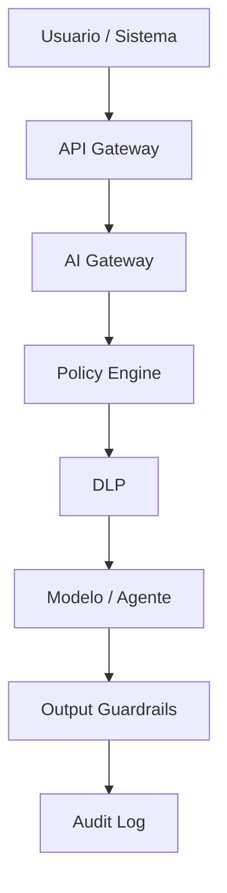

# Estándar de Seguridad para IA

# Propósito

Definir controles de seguridad para soluciones de IA, ML, LLMs, RAG y agentes en empresas reguladas.

# Principios

- Zero Trust para acceso a datos, herramientas y modelos.
- Minimización de datos en entrenamiento, inferencia y logs.
- Segregación de ambientes.
- Trazabilidad completa de decisiones automatizadas.
- Seguridad desde diseño y no como control posterior.

# Arquitectura de seguridad



# Controles mínimos

| Control | Descripción |
|---|---|
| SEC-AI-001 | autenticación fuerte para APIs de IA |
| SEC-AI-002 | autorización por dominio, rol y propósito |
| SEC-AI-003 | cifrado en tránsito y reposo |
| SEC-AI-004 | masking/tokenización de PII y PCI |
| SEC-AI-005 | segregación dev/test/prod |
| SEC-AI-006 | logging sin secretos |
| SEC-AI-007 | revisión de dependencias y modelos externos |
| SEC-AI-008 | pruebas adversariales antes de producción |

# Ejemplo realista de evento de seguridad

```json
{
  "event_id": "AI-SEC-2025-000771",
  "service": "customer-support-copilot",
  "detected_risk": "attempted_pan_extraction",
  "user_role": "call_center_agent",
  "policy_decision": "blocked",
  "severity": "high",
  "siem_case": "SOC-2025-99821"
}
```

# Requisitos para proveedores

Todo proveedor de IA debe evidenciar:

- ubicación y residencia de datos,
- política de entrenamiento con datos del cliente,
- cifrado,
- controles de acceso,
- certificaciones o reportes de seguridad,
- proceso de gestión de incidentes,
- derecho de auditoría o evidencias equivalentes.
