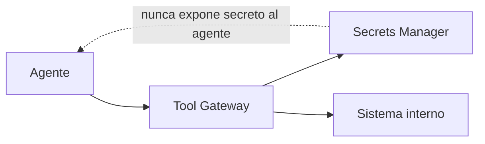

# Gestión de Secretos y Llaves en IA

# Propósito

Proteger API keys, tokens, credenciales, llaves de cifrado, secretos de proveedores y credenciales de herramientas usadas por modelos o agentes.

# Reglas

- Ningún secreto debe estar en prompts.
- Ningún secreto debe almacenarse en logs de inferencia.
- Los agentes no deben conocer secretos; deben invocar herramientas a través de un gateway seguro.
- Las credenciales deben rotarse y auditarse.

# Patrón recomendado



# Controles

| Control | Descripción |
|---|---|
| KEY-001 | secretos en vault corporativo |
| KEY-002 | rotación automática |
| KEY-003 | acceso por identidad de workload |
| KEY-004 | prohibido imprimir secretos en logs |
| KEY-005 | detección de secretos en repositorios |

# Ejemplo realista

```json
{
  "tool_call_id": "TOOL-2025-000233",
  "agent_id": "AGT-CLAIMS-CHARGEBACK-001",
  "secret_access": "via_workload_identity",
  "secret_exposed_to_model": false,
  "vault_policy": "ai-prod-tools-readonly"
}
```
