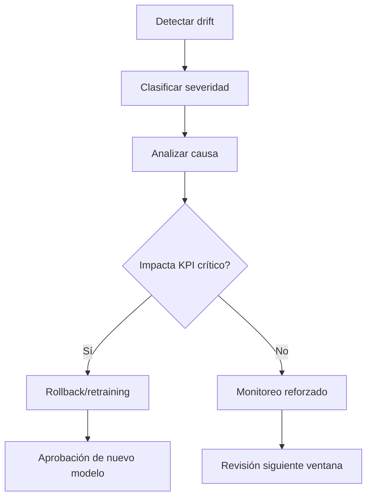

# Gestión de Drift

# Propósito

Detectar y gestionar cambios en datos, comportamiento del modelo y contexto de negocio que afecten confiabilidad, justicia o cumplimiento.

# Tipos de drift

| Tipo | Descripción | Ejemplo |
|---|---|---|
| data drift | cambia distribución de variables | suben transacciones ecommerce |
| concept drift | cambia relación X -> y | nuevo patrón de fraude |
| prediction drift | cambia distribución de scores | más clientes clasificados alto riesgo |
| policy drift | cambia la política de negocio | nueva regla de chargeback |

# Métrica PSI

| PSI | Interpretación |
|---|---|
| < 0.10 | estable |
| 0.10 - 0.25 | cambio moderado |
| > 0.25 | cambio significativo |

# Ejemplo realista

```json
{
  "feature": "merchant_category",
  "baseline_period": "2025-Q2",
  "current_period": "2025-Q4",
  "psi": 0.32,
  "main_shift": "travel_and_airline_transactions",
  "business_context": "campaña de viajes y temporada alta",
  "decision": "monitor + recalibrate threshold"
}
```

# Flujo



# Responsabilidades

| Rol | Responsabilidad |
|---|---|
| MLOps | detección automática |
| Data Scientist | análisis técnico |
| Business Owner | interpretación de negocio |
| Model Risk | validación independiente |
| AI Office | decisión de gobierno |
