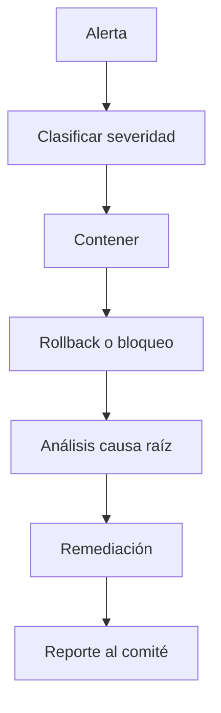

# Runbook de Incidentes de IA

# Propósito

Guiar la respuesta ante incidentes relacionados con modelos, LLMs, RAG, agentes o datos usados por IA.

# Severidades

| Severidad | Ejemplo | Tiempo objetivo |
|---|---|---:|
| SEV1 | fuga de PII o decisión masiva errónea | inmediato |
| SEV2 | drift crítico con impacto operacional | < 4 h |
| SEV3 | degradación de calidad | < 1 día |
| SEV4 | problema menor documental | planificado |

# Flujo

# Acciones por incidente

| Incidente | Acción inmediata |
|---|---|
| PII leakage | bloquear flujo, notificar seguridad |
| alucinación crítica | deshabilitar respuesta automática |
| tool abuse | revocar herramienta |
| drift crítico | activar champion anterior |
| sesgo crítico | suspender uso decisional |

# Evidencia mínima

- timestamp,
- servicio/modelo,
- versión,
- input anonimizado,
- output,
- decisión del guardrail,
- impacto estimado,
- responsable,
- acción correctiva.
