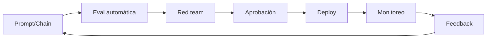

# Estándar LLMOps

# Propósito

Definir operación continua de soluciones basadas en LLMs, incluyendo prompts, RAG, evaluaciones, costos, seguridad y calidad.

# Componentes

| Componente | Función |
|---|---|
| prompt registry | versionar prompts |
| eval suite | pruebas automáticas |
| AI gateway | seguridad y políticas |
| vector store | recuperación documental |
| telemetry | métricas de uso/calidad |
| feedback loop | mejora continua |

# Pipeline LLMOps



# Métricas

| Métrica | Descripción |
|---|---|
| cost_per_interaction | costo promedio por interacción |
| groundedness | respuesta soportada por fuentes |
| hallucination_rate | respuestas no fundamentadas |
| escalation_rate | casos enviados a humano |
| containment_rate | casos resueltos sin escalar |

# Ejemplo realista

```json
{
  "app": "internal-customer-support-copilot",
  "period": "2025-10",
  "interactions": 184200,
  "avg_cost_usd": 0.013,
  "groundedness": 0.94,
  "hallucination_rate": 0.021,
  "human_escalation_rate": 0.27
}
```
