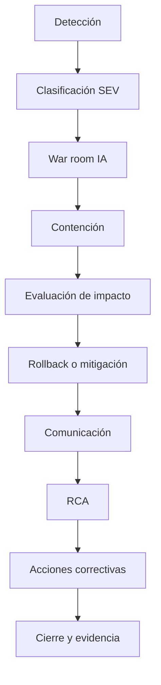

# AI Incident Management

> Nota de datos: los ejemplos usan datos realistas de industria financiera regulada y patrones operativos típicos de banca, tarjetas, seguros y fintech. No contienen datos productivos, PII real, PAN real ni información confidencial de ninguna empresa.

# Objetivo

Definir respuesta a incidentes de IA para ML tradicional, GenAI, RAG y agentes autónomos.

# Definición

Un incidente IA ocurre cuando un sistema de IA genera decisiones incorrectas a escala, afecta clientes, filtra información sensible, presenta sesgo material, alucina información crítica, opera fuera de límites aprobados o ejecuta acciones no autorizadas.

# Severidades

| Severidad | Descripción | Ejemplo | Respuesta |
|---|---|---|---|
| SEV-1 | Daño financiero, legal o regulatorio masivo | Rechazo sistémico de créditos | 15 min |
| SEV-2 | Impacto relevante contenido | Copiloto expone dato parcial | 30 min |
| SEV-3 | Desviación controlada | Drift alto sin impacto | 4 h |
| SEV-4 | Incidente menor | Error documental | 1 día |

# Tipos de incidente

## Model incident

- drift
- caída de precisión
- threshold incorrecto
- scoring invertido
- sesgo por segmento

## GenAI incident

- hallucination
- prompt injection
- data leakage
- unsafe output
- policy bypass

## Agent incident

- acción no autorizada
- tool misuse
- loop infinito
- ejecución sin aprobación humana

# Flujo

# Runbook SEV-1

## Contención

- activar modo seguro
- detener inferencias si impacto es material
- cambiar a modelo previo aprobado
- activar reglas determinísticas fallback
- bloquear tools peligrosas en agentes

## Evidencia

- snapshot de modelo
- logs de inferencia
- versión de features
- prompts
- respuestas
- trazas de agente
- decisiones humanas

# Ejemplo realista

| Campo | Valor |
|---|---|
| Incidente | AI-FRD-001 aumenta falsos positivos de 1.7% a 6.4% |
| Impacto | 18,420 transacciones bloqueadas en 3 horas |
| Clientes afectados | 2,170 |
| Causa preliminar | Cambio en feature `merchant_risk_score` |
| Respuesta | Rollback a `FRD-XGB-3.1` |
| Comunicación | Contact Center + Riesgos + AI Council |
