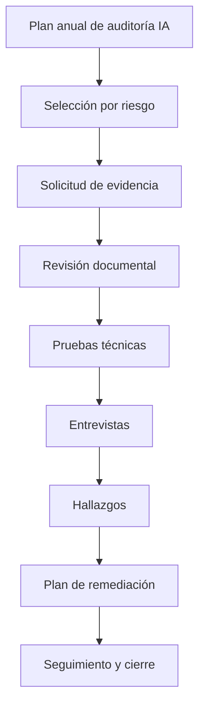

# AI Audit Framework

> Nota de datos: los ejemplos usan datos realistas de industria financiera regulada y patrones operativos típicos de banca, tarjetas, seguros y fintech. No contienen datos productivos, PII real, PAN real ni información confidencial de ninguna empresa.

# Objetivo

Definir un marco auditable para evaluar modelos predictivos, GenAI, RAG y agentes inteligentes en empresas reguladas.

# Alcance

## Sistemas incluidos

- Credit scoring
- Fraud detection
- Collections prioritization
- Customer service copilot
- RAG corporativo
- Automatización documental
- Agentes con tools

# Principios de auditoría

## Trazabilidad

Toda decisión asistida por IA debe poder reconstruirse desde caso de uso, dataset, features, versión de modelo, versión de prompt, configuración de runtime, usuario invocador, output generado y decisión humana final cuando aplique.

## Reproducibilidad

Los sistemas Tier 1 y Tier 2 deben poder reproducirse con artefactos versionados.

## Segregación de funciones

Quien desarrolla no debe aprobar de forma independiente modelos críticos.

## Evidencia verificable

La evidencia debe estar versionada, fechada, firmada y asociada a un control.

# Frecuencia mínima

| Tier | Tipo | Frecuencia |
|---|---|---|
| Tier 1 | Crédito, fraude, fondos, derechos del cliente | Trimestral |
| Tier 2 | Alto impacto operativo o reputacional | Semestral |
| Tier 3 | Soporte interno o productividad | Anual |
| Tier 4 | Bajo impacto | Bajo demanda |

# Evidencia mínima

| Dominio | Evidencia |
|---|---|
| Gobierno | Acta AI Council, RACI, clasificación de riesgo |
| Datos | Dataset Card, lineage, calidad, clasificación PII |
| Modelo | Model Card, validación, métricas, explicación |
| GenAI | Prompt registry, RAG eval, guardrails, red team |
| Seguridad | Threat model, pentest, IAM, logs |
| Operación | Drift, performance, incidentes, retraining |
| Compliance | DPIA, mapping regulatorio, aprobaciones |

# Flujo de auditoría

# Severidad

| Severidad | Definición | SLA |
|---|---|---|
| Crítica | Daño financiero, legal, regulatorio o discriminatorio | 15 días |
| Alta | Control clave ausente | 30 días |
| Media | Debilidad parcial | 60 días |
| Baja | Mejora documental | 90 días |

# Ejemplo realista

## Caso

Modelo de fraude `FRD-XGB-3.2`.

## Hallazgo

El modelo opera con AUC 0.971, pero 4.8% de inferencias batch no registran `feature_version`.

## Riesgo

No se puede reconstruir completamente la decisión ante reclamo de cliente.

## Acción

Hacer obligatorio `feature_version`, rechazar inferencias sin versión y registrar evidencia en `CTRL-MLOPS-007`.
