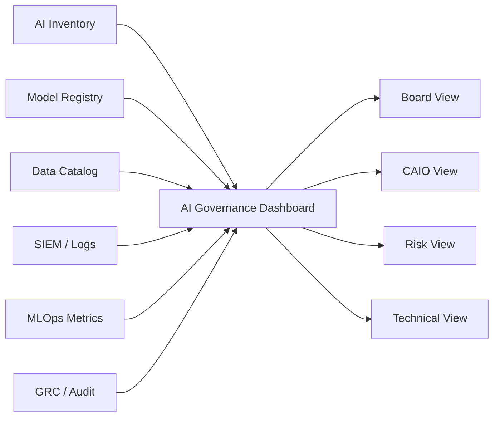

# AI Governance Dashboard

> Nota de datos: los ejemplos usan datos realistas de industria financiera regulada y patrones operativos típicos de banca, tarjetas, seguros y fintech. No contienen datos productivos, PII real, PAN real ni información confidencial de ninguna empresa.

# Objetivo

Definir un dashboard ejecutivo y operativo para seguimiento de gobierno de IA.

# Audiencias

| Audiencia | Vista |
|---|---|
| Directorio | Riesgo, compliance, valor |
| CAIO | Portfolio IA y madurez |
| CRO | Riesgo residual e incidentes |
| CISO | Seguridad IA y DLP |
| CDO | Lineage y calidad |
| Auditoría | Evidencia y hallazgos |
| MLOps | Drift, performance, SLO |

# AI Portfolio

| Métrica | Valor ejemplo |
|---|---:|
| Casos IA registrados | 64 |
| Productivos | 38 |
| En desarrollo | 17 |
| En evaluación | 9 |
| Tier 1 | 7 |
| Tier 2 | 14 |
| GenAI | 16 |
| Agentes autónomos | 4 |

# Risk Heatmap

| Riesgo | Bajo | Medio | Alto | Crítico |
|---|---:|---:|---:|---:|
| Datos | 21 | 12 | 4 | 0 |
| Modelo | 18 | 13 | 6 | 1 |
| Seguridad | 25 | 8 | 4 | 0 |
| GenAI | 7 | 6 | 3 | 0 |
| Compliance | 28 | 7 | 2 | 0 |

# Value Realization

| Iniciativa | Business case | Realizado YTD | % |
|---|---:|---:|---:|
| Fraud detection | PEN 9.2MM | PEN 7.8MM | 85% |
| Collections | PEN 5.5MM | PEN 4.1MM | 75% |
| Call center copilot | PEN 2.8MM | PEN 2.2MM | 79% |
| Marketing personalization | PEN 4.0MM | PEN 3.7MM | 93% |

# Vista GenAI

| Sistema | Grounding | Hallucination | Injection blocked | PII blocked | Estado |
|---|---:|---:|---:|---:|---|
| AI-CSC-002 | 96.8% | 1.4% | 99.9% | 100% | OK |
| AI-KB-004 | 93.1% | 2.8% | 99.5% | 100% | Warning |
| AGT-COL-001 | 97.2% | 0.9% | 100% | 100% | OK |

# Diagrama lógico

