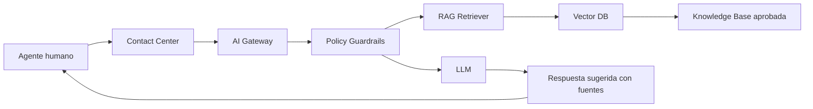

# Template — AI Project Document

> Nota de datos: los ejemplos usan datos realistas de industria financiera regulada y patrones operativos típicos de banca, tarjetas, seguros y fintech. No contienen datos productivos, PII real, PAN real ni información confidencial de ninguna empresa.

# Información general

| Campo | Valor |
|---|---|
| Project ID | AIPRJ-2026-0001 |
| Nombre | Copiloto de atención al cliente |
| Dominio | Customer Service |
| Tipo IA | GenAI + RAG |
| Sponsor | COO |
| Owner negocio | Atención al Cliente |
| Owner técnico | AI Platform |
| Tier | Tier 2 |

# Problema

El contact center recibe altos volúmenes de consultas sobre estados de cuenta, beneficios, pagos, campañas y reclamos. Los agentes tienen tiempos altos de búsqueda documental y variabilidad en calidad de respuesta.

# Objetivos

## Negocio

- Reducir Average Handling Time.
- Mejorar consistencia.
- Aumentar First Contact Resolution.
- Reducir entrenamiento de agentes.

## Control

- Evitar fuga de PII.
- Evitar respuestas sin fuente.
- Mantener supervisión humana.
- Registrar prompts y respuestas.

# Alcance

## Incluye

- RAG sobre base aprobada.
- Sugerencia de respuesta al agente humano.
- Resumen de conversación.
- Clasificación de intención.

## Excluye

- Responder directo al cliente sin humano.
- Ejecutar transacciones financieras.
- Modificar datos del cliente.
- Procesar PAN completo.

# Arquitectura conceptual

# Métricas

| Métrica | Baseline | Target |
|---|---:|---:|
| AHT | 6.8 min | 5.9 min |
| FCR | 71% | 78% |
| Grounding | N/A | >95% |
| Hallucination | N/A | <2% |
| PII leakage | 0 | 0 |
