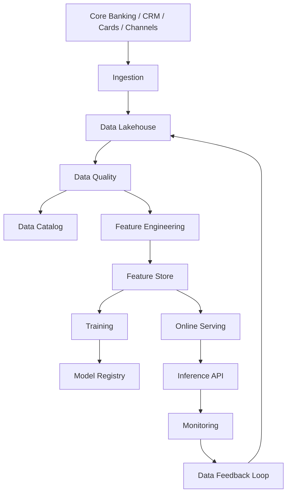

# AI Data Architecture

> Nota de datos: los ejemplos usan datos realistas de industria financiera regulada y patrones operativos típicos de banca, tarjetas, seguros y fintech. No contienen datos productivos, PII real, PAN real ni información confidencial de ninguna empresa.

# Objetivo

Definir arquitectura de datos para IA con gobierno, calidad, privacidad, lineage y operación.

# Principios

## Data as governed product

Cada dataset usado por IA debe tener owner, steward, definición, SLA, calidad, lineage, clasificación, retención y controles de acceso.

## Feature consistency

Las features deben ser consistentes entre entrenamiento e inferencia.

## Privacy by design

La PII debe minimizarse, tokenizarse o anonimizarse antes de entrenamiento o inferencia.

# Arquitectura

# Dominios

| Dominio | Ejemplos | Sensibilidad |
|---|---|---|
| Customer | perfil, segmento, contacto | Alta |
| Card | producto, estado, límite | Alta |
| Transactions | monto, comercio, canal | Alta |
| Fraud | alertas, chargebacks | Alta |
| Collections | mora, promesas | Alta |
| Digital | dispositivo, sesión, IP | Alta |
| Product | beneficios, tarifas | Media |

# Dataset realista

| Campo | Valor |
|---|---|
| Dataset ID | DS-CARD-TRX-RISK-2025-v17 |
| Nombre | Transacciones de tarjeta para riesgo |
| Owner | Riesgo Operacional |
| Registros | 171MM anuales |
| Frecuencia | Near real-time |
| PII | Tokenizada |
| PAN | No disponible |
| Retención | 7 años |
| Calidad | 98.7% |

# Data quality rules

| Regla | Umbral |
|---|---|
| `amount_pen` no nulo | 99.99% |
| `mcc` válido | 99.95% |
| `transaction_ts` válido | 100% |
| `card_token` presente | 100% |
| duplicados `trx_id` | 0 |
| freshness online | <2 segundos |
