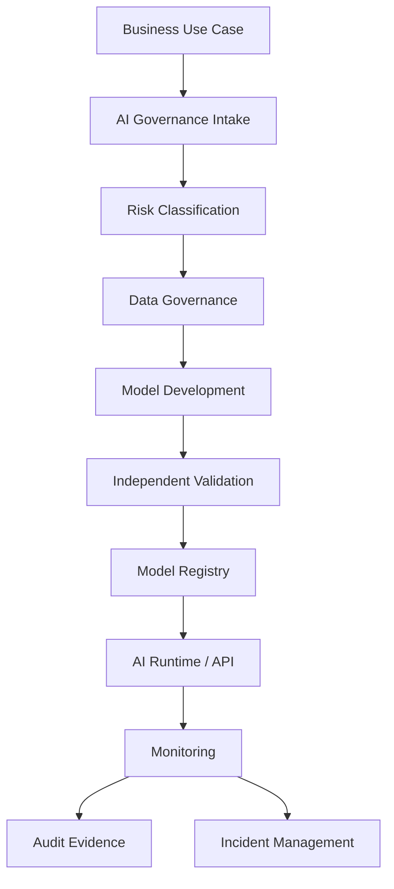

# AI Reference Architecture

> Nota de datos: los ejemplos usan datos realistas de industria financiera regulada y patrones operativos típicos de banca, tarjetas, seguros y fintech. No contienen datos productivos, PII real, PAN real ni información confidencial de ninguna empresa.

# Objetivo

Definir arquitectura de referencia para soluciones de IA en empresas reguladas.

# Principios

## Arquitectura gobernada

Toda solución IA debe integrarse a AI Use Case Register, Data Catalog, Model Registry, Feature Store, AI Gateway, Observability, SIEM y GRC.

# Capas

| Capa | Responsabilidad |
|---|---|
| Business | Objetivo, decisión, impacto |
| Governance | Políticas, riesgo, aprobación |
| Data | Datos, calidad, lineage |
| Model | Entrenamiento, validación, versionado |
| Runtime | Inferencia, APIs, seguridad |
| Monitoring | Drift, performance, incidentes |
| Audit | Evidencia y compliance |

# Arquitectura lógica

# Componentes

| Componente | Responsabilidad |
|---|---|
| AI Gateway | Auth, DLP, logging, policies, routing |
| Model Registry | Versiones, estados, aprobaciones, rollback |
| Feature Store | Consistencia entrenamiento/inferencia |
| Monitoring | Drift, bias, latencia, costo, errores |
| Evidence Repository | Evidencia audit-ready |

# Stack referencial

| Capability | Herramientas posibles |
|---|---|
| Data Catalog | DataHub, Collibra, Alation |
| Feature Store | Feast, Tecton |
| Tracking | MLflow, Weights & Biases |
| Serving | KServe, Seldon, BentoML |
| Monitoring | Evidently, WhyLabs, Grafana |
| API Gateway | Kong, Apigee |
| SIEM | Splunk, Sentinel, Chronicle |
