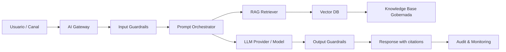

# GenAI Reference Architecture

> Nota de datos: los ejemplos usan datos realistas de industria financiera regulada y patrones operativos típicos de banca, tarjetas, seguros y fintech. No contienen datos productivos, PII real, PAN real ni información confidencial de ninguna empresa.

# Objetivo

Definir arquitectura de referencia para LLMs, RAG, copilotos y agentes.

# Principios

## No confiar directamente en el LLM

El LLM debe estar encapsulado por AI Gateway, guardrails, DLP, prompt registry, evaluation layer, observability y human oversight cuando aplique.

## Fuentes gobernadas

RAG solo debe usar fuentes aprobadas, versionadas, clasificadas, con owner y vigencia.

# Arquitectura



# Componentes

| Componente | Responsabilidad |
|---|---|
| AI Gateway | Auth, DLP, cost tracking, policy enforcement |
| Prompt Orchestrator | Templates, variables, routing, fallback |
| RAG Retriever | Search, reranking, permisos, citations |
| Guardrails | Input/output filtering, PII, hallucination |
| Evaluation Layer | Grounding, toxicity, leakage, injection |

# Datos prohibidos hacia LLM externo

| Dato | Política |
|---|---|
| PAN completo | Bloqueado |
| CVV | Bloqueado |
| PIN | Bloqueado |
| Token secreto | Bloqueado |
| DNI sin propósito aprobado | Bloqueado |
| PII no minimizada | Bloqueado |

# Evaluaciones

| Evaluación | Métrica |
|---|---|
| Grounding | % respuestas con fuente válida |
| Hallucination | % respuestas no soportadas |
| Prompt injection | tasa de éxito |
| PII leakage | tasa de fuga |
| Toxicity | tasa de violación |
| Cost | costo por interacción |

# Ejemplo de log

```json
{
  "ai_system_id": "AI-CSC-002",
  "prompt_version": "pmt-csc-v12",
  "rag_index": "kb-products-2026-06-v3",
  "grounding_score": 0.96,
  "pii_detected": false,
  "prompt_injection_score": 0.02,
  "output_policy": "ALLOW",
  "human_review_required": true
}
```
