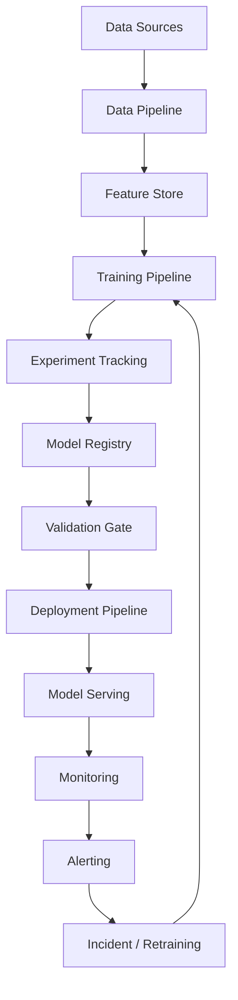

# ModelOps Architecture

> Nota de datos: los ejemplos usan datos realistas de industria financiera regulada y patrones operativos típicos de banca, tarjetas, seguros y fintech. No contienen datos productivos, PII real, PAN real ni información confidencial de ninguna empresa.

# Objetivo

Definir arquitectura de operación, monitoreo, despliegue, rollback y retraining de modelos IA.

# Capacidades

| Capacidad | Descripción |
|---|---|
| Experiment tracking | Experimentos reproducibles |
| Model registry | Versionado y aprobaciones |
| CI/CD ML | Validaciones automatizadas |
| Feature monitoring | Freshness, drift, calidad |
| Model monitoring | Performance, drift, sesgo |
| Incident response | Runbooks y rollback |
| Retraining | Pipeline controlado |

# Arquitectura

# Gates

| Gate | Condición |
|---|---|
| Data Quality | Sin errores críticos |
| Security | Sin secretos ni vulnerabilidades críticas |
| Model Quality | Métricas superiores a baseline |
| Fairness | Delta dentro de umbral |
| Explainability | Reason codes disponibles |
| Approval | AI Council / Model Risk |
| Production Readiness | Runbook, SLO, rollback |

# Rollback automático

| Condición | Acción |
|---|---|
| Error rate >2% por 5 min | Rollback |
| Latency P95 >2x SLA por 10 min | Rollback |
| FPR sube >1 pp | Pausar y revisar |
| PSI >0.25 en feature crítica | Alerta |
| Incidente SEV-1 | Rollback inmediato |
