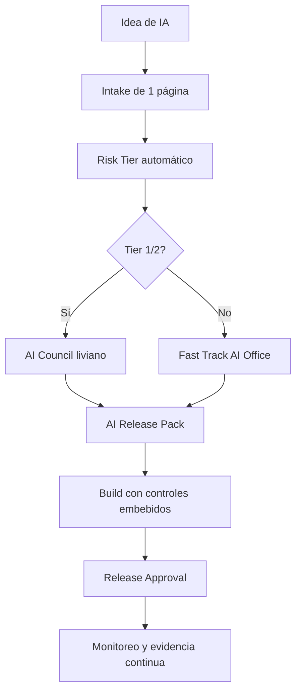

# Gobierno de IA Fintech Lite / Agile

> Nota: todos los ejemplos y registros usan datos simulados realistas para una fintech. No contienen datos productivos, PII real, PAN real, secretos, credenciales ni información confidencial.

# Propósito

Este repositorio es una versión liviana del framework de Gobierno de IA para una fintech regulada. Mantiene los controles mínimos de IA responsable, seguridad, riesgo, auditoría y operación, pero reduce la documentación para que pueda ser implementada por squads ágiles sin crear una oficina burocrática.

# Qué problema resuelve

El repositorio original separaba estrategia, gobierno, riesgo, datos, modelos, GenAI, seguridad, ModelOps, auditoría, KPIs, templates y arquitectura en muchos documentos. Esta versión consolida esos dominios en un set mínimo de artefactos operativos.

# Principios de diseño

| Principio | Aplicación práctica |
|---|---|
| Gobierno proporcional al riesgo | Tier 1 y 2 tienen revisión formal; Tier 3 y 4 usan fast track con evidencias mínimas. |
| Documentación como producto | Cada documento debe ayudar a tomar una decisión, aprobar un release o demostrar control. |
| Control embebido en el delivery | El squad completa el AI Release Pack durante discovery, build y release. |
| Evidencia reutilizable | Un mismo registro sirve para gobierno, auditoría, ModelOps y compliance. |
| Agilidad con accountability | Menos documentos, pero owners, decisiones y riesgos siempre trazables. |

# Estructura mínima

```text
gobierno-ia-fintech-lite/
├── README.md
├── mkdocs.yml
├── 00-implementacion/
│   └── guia-90-dias.md
├── 01-gobierno/
│   ├── politica-y-charter-ia-lite.md
│   ├── modelo-operativo-raci.md
│   └── intake-y-portfolio.md
├── 02-riesgo-controles/
│   ├── clasificacion-riesgo-y-controles.md
│   └── mapeo-estandares.md
├── 03-data-model-genai/
│   ├── data-model-governance.md
│   └── genai-rag-agent-governance.md
├── 04-operacion-auditoria/
│   ├── seguridad-modelops-evidencias.md
│   └── kpis-y-dashboard.md
├── templates/
│   ├── ai-use-case-intake.md
│   ├── ai-risk-assessment.md
│   ├── model-card-lite.md
│   └── exception-request.md
├── data-simulada/
│   ├── ai_use_cases.csv
│   ├── model_registry.csv
│   ├── risk_assessments.csv
│   ├── controls_evidence.csv
│   ├── model_metrics.csv
│   ├── rag_evaluation.csv
│   └── incidents.csv
└── diagrams/
    ├── ai-governance-agile-lifecycle.mmd
    └── ai-release-pack-flow.mmd
```

# Documentos core

| Documento | Reemplaza documentos del framework completo | Cuándo se usa |
|---|---|---|
| `politica-y-charter-ia-lite.md` | AI Policy, AI Governance Charter, Ethics Principles | Define reglas corporativas, usos permitidos/restringidos/prohibidos y autoridad mínima. |
| `modelo-operativo-raci.md` | Operating Model, Council, RACI | Define roles, comité liviano y derechos de decisión. |
| `intake-y-portfolio.md` | Use Case Intake, Roadmap, Prioritization | Registra, prioriza y mantiene inventario de casos IA. |
| `clasificacion-riesgo-y-controles.md` | Risk Framework, Scoring Matrix, Controls Catalog | Calcula tier de riesgo y asigna controles mínimos. |
| `mapeo-estandares.md` | Regulatory Mapping, Audit Framework | Mapea controles a NIST AI RMF, ISO 42001, EU AI Act, ISO 27001, PCI DSS, SR 11-7 y OWASP LLM. |
| `data-model-governance.md` | Data Policy, Dataset Registry, Model Card, Validation Report | Consolida dataset card, model card lite y validación mínima. |
| `genai-rag-agent-governance.md` | LLM, RAG, Prompt, Agent, Guardrails, HITL | Define controles para LLMs, RAG y agentes. |
| `seguridad-modelops-evidencias.md` | Security Standard, Monitoring, Drift, Incident, Evidence | Define controles técnicos, monitoreo y evidencias de operación. |
| `kpis-y-dashboard.md` | KPIs, Governance Dashboard, Value Realization | Dashboard ejecutivo y operativo. |

# Flujo agile propuesto



# AI Release Pack mínimo

El `AI Release Pack` es el paquete único de evidencia para pasar a producción. Evita múltiples documentos separados.

| Evidencia | Tier 1 | Tier 2 | Tier 3 | Tier 4 |
|---|---:|---:|---:|---:|
| Use Case Intake | Sí | Sí | Sí | Sí |
| Risk Assessment | Sí | Sí | Sí | Sí, simple |
| Data & Privacy Review | Sí | Sí | Si usa PII | No, salvo PII |
| Model Card Lite o GenAI Card | Sí | Sí | Sí | Opcional |
| Validación independiente | Sí | Según impacto | No | No |
| Security Review | Sí | Sí | Sí | Básico |
| Monitoring Plan | Sí | Sí | Sí | Básico |
| Human Oversight | Sí | Sí | Si impacta cliente | No |
| Evidence Log | Sí | Sí | Sí | Sí |

# Datos simulados incluidos

Los archivos CSV permiten iniciar un dashboard o cargar ejemplos a Jira, ServiceNow, GRC, Data Catalog, MLflow, Grafana o una wiki interna. Los registros simulan casos como fraude transaccional, scoring alternativo, RAG normativo, copiloto de atención, agente de conciliaciones, OCR KYC y predicción de mora temprana.

# Cómo usarlo en una fintech

1. Crear un repositorio interno con esta estructura.
2. Definir un AI Office liviano: Arquitectura, Riesgos, Seguridad, Data, Legal/Compliance y Product.
3. Registrar todos los casos en `data-simulada/ai_use_cases.csv` o su equivalente real.
4. Usar `templates/ai-use-case-intake.md` y `templates/ai-risk-assessment.md` desde discovery.
5. Exigir el AI Release Pack solo al pasar a producción.
6. Revisar mensualmente KPIs, incidentes, excepciones y modelos Tier 1/2.

# Reglas de actualización

| Cambio | Quién aprueba | Evidencia |
|---|---|---|
| Nuevo caso Tier 3/4 | AI Office | Intake + risk assessment |
| Nuevo caso Tier 1/2 | AI Council | AI Release Pack |
| Cambio de modelo productivo | Model Owner + AI Office | Model Card Lite + métricas |
| Cambio de prompt crítico | Product Owner + Security | Prompt diff + evaluación |
| Excepción de control | Risk Owner + AI Lead | Exception Request |
| Incidente Sev1/Sev2 | AI Ops + CISO + Risk | Incident log + RCA |
