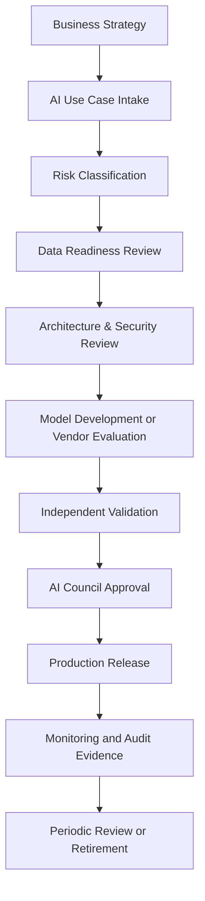

# Arquitectura de Gobierno de IA

# Propósito

Este repositorio define una metodología híbrida de Gobierno de Inteligencia Artificial 
para empresas reguladas. Combina gobierno ejecutivo, 
gestión de riesgos, arquitectura empresarial y controles técnicos.

El framework busca que una organización pueda identificar, priorizar, aprobar, 
construir, operar, monitorear y auditar soluciones de IA, IA Generativa 
y agentes inteligentes de forma responsable, segura y trazable.

# Alcance

El marco aplica a iniciativas de:

- Machine Learning predictivo.
- Modelos de scoring, fraude, cobranza y recomendación.
- IA Generativa para atención, productividad, análisis documental y copilotos internos.
- Arquitecturas RAG.
- Agentes inteligentes con herramientas, memoria, autonomía parcial o integración con sistemas corporativos.
- Modelos propios, modelos open source, servicios SaaS de IA y modelos de terceros.

# Metodología usada

La metodología se organiza en fases, cada una asociada a artefactos de gobierno, 
controles y entregables.

## Fase 1: Strategy & AI Governance Foundation

Define la visión, principios, alcance, roles, comités, apetito de riesgo y 
modelo operativo de IA.

Artefactos principales:

- AI Governance Charter.
- AI Operating Model.
- AI Maturity Model.
- AI Roadmap.
- AI Investment Prioritization.
- AI Policy.
- AI Ethics Principles.
- AI Decision Rights RACI.
- AI Council Operating Model.
- AI Use Case Intake Process.

Frameworks usados:

- ISO/IEC 42001 para sistema de gestión de IA.
- NIST AI RMF para gobierno, mapeo, medición y gestión del riesgo.
- COBIT para gobierno de tecnología.
- TOGAF para gobierno de arquitectura.

## Fase 2: Data & Risk Governance

Controla datos, riesgos, calidad, linaje, privacidad, clasificación de casos de uso y 
evaluación de impacto.

Frameworks usados:

- DAMA DMBOK.
- DCAM.
- NIST AI RMF.
- EU AI Act como referencia de clasificación de riesgo.
- SR 11-7 como referencia de model risk management en banca.

## Fase 3: Model, GenAI & Agent Governance

Define cómo se documentan, validan, aprueban, versionan y monitorean modelos 
tradicionales, LLMs y agentes.

Frameworks usados:

- Model Risk Management.
- NIST AI RMF.
- ISO/IEC 42001.
- OWASP Top 10 for LLM Applications.
- LLMOps y MLOps practices.

## Fase 4: Runtime, Audit & Continuous Assurance

Define observabilidad, drift, incidentes, auditoría, evidencias, KPIs, 
auditoría continua y mejora del framework.

Frameworks usados:

- ISO 27001.
- PCI DSS, cuando existan datos de tarjetas.
- COBIT.
- NIST AI RMF.
- ISO/IEC 42001.

# Modelo de gobierno de extremo a extremo



# Principios rectores

## IA responsable por diseño

Cada iniciativa de IA debe incorporar controles de privacidad, seguridad, 
explicabilidad, trazabilidad y supervisión humana desde su fase de ideación.

## Riesgo proporcional

Los controles se aplican según el impacto del caso de uso. 
Un modelo de scoring crediticio requiere mayor revisión que un asistente interno 
de resumen documental.

## Trazabilidad completa

Toda decisión relevante debe poder responder:

- Qué modelo se usó.
- Qué versión estaba activa.
- Qué datos alimentaron el resultado.
- Quién aprobó el despliegue.
- Qué controles se ejecutaron.
- Qué explicación se entregó al negocio, auditoría o regulador.

## Human-in-the-loop

Las decisiones de alto impacto no deben ejecutarse de forma completamente autónoma 
sin mecanismos de revisión, apelación o intervención humana.


# Cómo usar este framework

## Para C level

Usar los documentos de estrategia, operating model, roadmap, KPIs y comité para formalizar la Oficina de IA.

## Para Arquitectura Empresarial

Usar los estándares, diagramas y procesos de revisión para integrar IA al gobierno de arquitectura.

## Para Riesgos y Compliance

Usar la clasificación de riesgo, RACI, políticas y evidencias de aprobación para auditoría y control.

## Para Equipos Técnicos

Usar los procesos de intake, validación, checklist y criterios de despliegue para implementar IA con trazabilidad.

# Estructura consolidada

```text
arquitectura-gobierno-ia/
├── README.md
├── mkdocs.yml
├── LICENSE
├── 01-strategy/
├── 02-governance/
├── 03-risk/
├── 04-data-governance/
├── 05-model-governance/
├── 06-genai-agent-governance/
├── 07-security/
├── 08-modelops/
├── 09-audit-compliance/
├── 10-kpis/
├── 11-templates/
├── 12-reference-architecture/
└── diagrams/
```

# Cobertura metodológica final

| Fase | Objetivo | Documentación principal |
|---|---|---|
| 1. Estrategia y fundación | Definir mandato, operating model, roadmap y comité IA | `01-strategy`, `02-governance` |
| 2. Riesgo y datos | Clasificar riesgos, controlar datos, calidad, privacidad y lineage | `03-risk`, `04-data-governance` |
| 3. Modelos, GenAI y agentes | Gobernar modelos, LLMs, RAG, prompts, agentes y guardrails | `05-model-governance`, `06-genai-agent-governance` |
| 4. Seguridad y operación | Operar con seguridad, monitoreo, drift, SLOs, LLMOps y AI FinOps | `07-security`, `08-modelops` |
| 5. Auditoría y assurance | Gestionar evidencia, controles, incidentes, compliance y auditoría | `09-audit-compliance` |
| 6. Medición de valor | Medir KPIs, valor realizado y dashboard ejecutivo CAIO | `10-kpis` |
| 7. Estandarización | Usar templates, ADRs y arquitecturas de referencia | `11-templates`, `12-reference-architecture`, `diagrams` |


