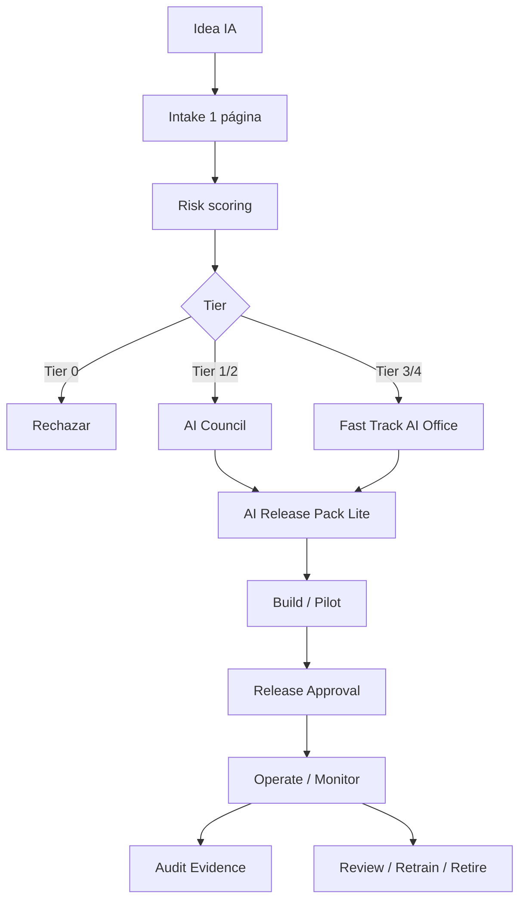
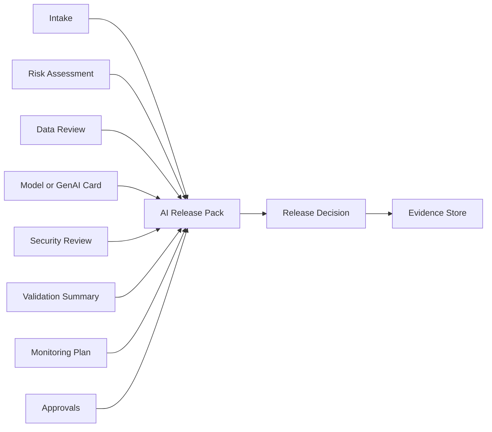

# Diagramas

Los diagramas Mermaid usados por el framework se renderizan directamente en la web. También puedes descargar los archivos fuente `.mmd`.

## Ciclo de vida agile de Gobierno de IA

[Descargar fuente Mermaid](diagrams/ai-governance-agile-lifecycle.mmd)

## Flujo del AI Release Pack

[Descargar fuente Mermaid](diagrams/ai-release-pack-flow.mmd)

